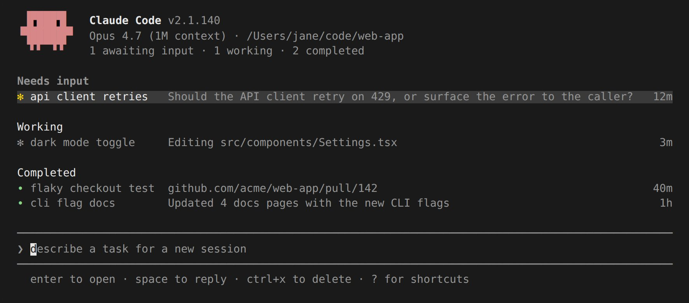

# 用 Agent View 管理多个代理

> **一句话概括：** 在一个界面上派发和管理多个 Claude Code 会话。Agent View 展示每个会话正在做什么，以及哪些需要你介入。

**Agent View 是后台会话的统一控制台。** 通过 `claude agents` 打开，你可以看到所有后台会话的实时状态：正在运行的、需要你输入的、已完成的。你可以派发新会话、一目了然地掌握进度，只在需要时才介入。每个后台会话都是一个完整的 Claude Code 对话，不依赖终端持续运行——随时打开、回复、离开。




**适用场景：多个独立任务并行推进。** 比如同时派发一个 Bug 修复、一个 PR Review、一个 Flaky Test 排查，各自独立运行，你只需在某行显示"需要输入"或已有结果时回来查看。

当你想深入某个会话的完整对话时，可以 attach 到对应的行。

如需比较 Agent View 与子代理、代理团队、Worktree 的区别，参见 [并行运行代理](https://code.claude.com/docs/en/agents)。

> **注意：** Agent View 处于研究预览阶段，需要 Claude Code v2.1.139 或更高版本。用 `claude --version` 查看版本。界面和快捷键可能随版本演进而变化。

本文涵盖：

* [快速上手](#快速上手)：给 Claude 一个后台任务，监控进度，需要时介入
* [用 Agent View 监控会话](#用-agent-view-监控会话)：状态图标、Peek 与回复、Attach、组织列表、快捷键
* [派发新代理](#派发新代理)：从 Agent View、从会话内部、从 Shell 启动
* [从 Shell 管理会话](#从-shell-管理会话)
* [后台会话的托管机制](#后台会话的托管机制)：Supervisor 进程

## 快速上手

**核心循环：派发 -> 观察 -> Peek/回复 -> Attach。** 下面演示完整流程。派发的会话在你关闭 Agent View 后继续运行，随时可以回来查看。

### 第一步：打开 Agent View

在终端运行：

```bash
claude agents
```

Agent View 打开后，底部有输入框，表格随着会话启动逐步填充。按 `Esc` 随时退出回到 Shell。会话在你离开期间持续运行，下次打开时重新出现。

### 第二步：派发一个会话

输入任务描述并按 `Enter`。一个新的后台会话启动并显示为一行，标记其当前状态（工作中/等待输入/已完成）。新会话使用 Agent View 顶栏显示的模型，以及你在该目录下运行 `claude` 时相同的权限模式。

每次输入都会启动一个全新会话。再输入一个 prompt 按 `Enter` 会启动第二个并行会话，而不是给第一个发送后续消息。可以这样同时运行多个。

每个会话独立消耗你的订阅配额，派发大量会话前请参阅 [限制](#限制)。

### 第三步：Peek 与回复

用方向键选中一行，按 `Space` 打开 Peek 面板。它显示会话最近的输出或正在等待的问题，而非完整对话。输入回复按 `Enter` 即可发送，无需离开 Agent View。

### 第四步：Attach 与 Detach

在选中行按 `Enter` 或 `→` 进行 Attach。终端切换为完整的交互式 Claude Code 会话。在空 prompt 上按 `←` 即可 Detach 回到列表。

### 第五步：把现有会话放入后台

在已有会话中运行 `/bg`，或在空 prompt 上按 `←`，会话转入后台并打开 Agent View。会话继续运行，和你派发的会话并列显示。

---

**你可以把 `claude agents` 作为主入口**：所有任务都从 Agent View 派发，需要完整对话时 Attach，按 `←` 回到列表。

## 用 Agent View 监控会话

**Agent View 按状态分组列出所有后台会话。** 运行 `claude agents` 打开，占据整个终端，每行显示会话名称、当前活动和最后更新时间。置顶的和需要你输入的排在最前。

**默认展示所有项目的后台会话。** 不论你在哪个目录打开 Agent View，所有后台会话都会出现。要限定范围，使用 `--cwd`（需 v2.1.141+）：

```bash
claude agents --cwd ~/projects/my-app
```

只显示在该目录下启动的会话。已移入 `~/projects/my-app/.claude/worktrees/` 下 Worktree 的会话仍算属于 `~/projects/my-app`。

在其他终端打开的交互式会话不会出现，除非你[将它们放入后台](#从会话内部派发)。子代理和队友不会作为单独行显示。

```text
Pinned
  ✽ clawd walk cycle          Write assets/sprites/clawd-walk.png           3m

Ready for review
  ∙ jump physics              Opened PR with collision fix              PR #2048  2h

Needs input
  ✻ power-up design           needs input: double jump or wall climb?       1m

Working
  ✽ collision detection       Edit src/physics/CollisionSystem.ts           2m
  ✢ playtest level 3          run 12 · all checkpoints cleared           in 4m

Completed
  ✻ title screen              result: menu, options, and credits done       9m
  ∙ sound effects             result: 14 SFX exported to assets/audio       4h
  … 6 more
```

### 读取会话状态

**每行开头的图标通过颜色和动画指示状态：**

| 状态 | 图标表现 | 含义 |
| :--- | :--- | :--- |
| Working | 动画 | Claude 正在执行工具或生成响应 |
| Needs input | 黄色 | Claude 在等你回答一个问题或处理权限请求 |
| Idle | 暗色 | 会话无事可做，等待你的下一个 prompt |
| Completed | 绿色 | 任务成功完成 |
| Failed | 红色 | 任务以错误结束 |
| Stopped | 灰色 | 会话被 `Ctrl+X` 或 `claude stop` 停止 |

**图标形状表示底层进程是否存活：**

| 形状 | 含义 |
| :--- | :--- |
| `✻` 或动画 `✽` | 会话进程存活，可立即响应 |
| `∙` | 进程已退出。仍可 Peek、回复或 Attach，Claude 会从中断处重启 |
| `✢` | [`/loop`](https://code.claude.com/docs/en/scheduled-tasks) 会话在迭代间休眠。行末显示运行次数和倒计时 |

行右侧可能出现的 `PR #N` 标签是会话创建的 [PR 状态](#pr-状态)，不属于状态图标。多个 PR 时显示计数如 `3 PRs`。

**终端标签页标题反映等待输入的数量：** 如 `2 awaiting input · claude agents`，无等待时显示 `claude agents`。

**后台会话不依赖任何终端窗口。** 独立的 [Supervisor 进程](#supervisor-进程) 托管它们，你可以关闭 Agent View、关闭 Shell、启动新的交互会话，派发的任务继续运行。

**会话状态跨更新和重启持久化。** 机器休眠时会话也会保留，唤醒后进程恢复，Supervisor 重新连接。关机则会停止运行中的会话，参见[关机后会话显示失败](#关机后会话显示为失败)了解恢复方法。

### 行摘要

**一行摘要由 Haiku 级模型生成。** 让你无需打开完整对话就知道会话在做什么、需要什么、产出了什么。会话活跃工作时，摘要最多每 15 秒刷新一次，每个 Turn 结束后也会刷新一次。

从 v2.1.161 起，当会话同时运行多个并行工作项（如子代理、后台 Shell 命令、监控器）时，摘要前会显示 `done/total` 计数如 `2/5`。

每次刷新是一次短的 Haiku 级请求，通过你的正常 Provider 计费，遵循与会话本身相同的[数据使用条款](https://code.claude.com/docs/en/data-usage)。在 Bedrock、Vertex AI、Microsoft Foundry 等第三方 Provider 上，如果没有配置 Haiku 模型，请求会回退到会话的主模型。用 [`ANTHROPIC_DEFAULT_HAIKU_MODEL`](https://code.claude.com/docs/en/model-config#environment-variables) 设置这些摘要使用的模型。

### PR 状态

**会话创建 PR 后，行右侧出现 `PR #1234` 标签。** 在支持超链接的终端中可点击。发送后续消息后标签保留，行内容恢复为实时进度。

多个 PR 时显示计数如 `3 PRs`，颜色取最需关注的 PR。打开 [Peek 面板](#peek-与回复)可查看全部。

**PR 编号颜色对应状态：**

| 颜色 | PR 状态 |
| :--- | :--- |
| 黄色 | 等待 CI 或 Review，或 CI 失败 |
| 绿色 | CI 通过且无 Review 阻塞 |
| 紫色 | 已合并 |
| 灰色 | Draft 或已关闭 |

对大多数任务来说，这一列就是你收取结果的地方：PR 编号变绿时去 Review 和合并即可。

### Peek 与回复

**按 `Space` 打开 Peek 面板，快速查看会话需要什么。** 显示会话等待你做什么、最近输出、以及已创建的 PR。大多数时候这就够了，不需要打开完整对话。

从 v2.1.161 起，当会话运行并行工作项时，面板还会显示运行时间最长的那个及其持续时间，无需 Attach 即可了解会话在等什么。

在 Peek 面板输入回复按 `Enter` 发送。会话提出多选题时，面板显示选项，按数字键选择。对其他阻塞会话，按 `Tab` 填充建议回复，可编辑后发送。回复前加 `!` 可发送一条 Bash 命令。

从 v2.1.145 起，启用[语音听写](https://code.claude.com/docs/en/voice-dictation)后，回复输入框聚焦时按住或点击 Push-to-talk 键可以用语音回复。派发输入框同样支持。

按 `↑` `↓` 在相邻会话间 Peek 而不关闭面板，按 `→` 进入 Attach。

### Attach 到会话

**按 `Enter` 或 `→` 进入完整交互会话。** Agent View 被替换为完整会话。Attach 时 Claude 会简要回顾你不在期间发生的事。

Attach 后，会话和普通 Claude Code 会话完全一样：所有[命令](https://code.claude.com/docs/en/commands)、快捷键和功能都可用。

Attach 的会话始终以[全屏模式](https://code.claude.com/docs/en/fullscreen)渲染，与 `tui` 设置无关，因为后台会话没有终端回滚缓冲区。用 `PgUp`、`PgDn` 或鼠标滚轮滚动，按 `Ctrl+O` 进入 Transcript 模式。终端原生滚动和 tmux copy mode 只显示当前视口。

**Detach 回到 Agent View：** 在空 prompt 上按 `←`。如果对话框获得焦点且 `←` 无响应，按 `Ctrl+Z` 立即 Detach。

`Ctrl+C` 保持标准中断行为：取消正在运行的响应或 `!` Shell 命令，而非 Detach。在空 prompt 上连按两次 `Ctrl+C` 则 Detach。

**Detach 不会停止后台会话。** `←`、`Ctrl+Z`、`/exit`、双击 `Ctrl+C` 或 `Ctrl+D` 都只是离开会话，会话继续运行。要终止会话，运行 `/stop`。

从任何 Claude Code 会话按空 prompt 上的 `←` 都能进入 Agent View，不限于从 Agent View 内 Attach 的会话。它会将当前会话放入后台并在 Agent View 中选中对应行，方便切换会话。可在 `/config` 中关闭此快捷键（`leftArrowOpensAgents` 设置）。

### 组织列表

**Agent View 按状态分组，需要输入的排在最上。** `Ready for review` 和 `Needs input` 在 `Working` 和 `Completed` 之上。这些分组名和[状态](#读取会话状态)不完全对应：有未关闭 PR 的会话进入 `Ready for review`，`Completed` 收集已完成、失败和已停止的会话。

按 `Ctrl+S` 切换为按目录分组。选择跨次运行持久化。

组内操作：

* `Ctrl+T`：置顶会话并[保持其进程运行](#supervisor-进程)
* `Shift+↑` / `Shift+↓`：调整顺序
* `Ctrl+R`：重命名会话
* 在组标题上按 `Enter`：折叠该组

**删除会话：** 按 `Ctrl+X` 停止，两秒内再按 `Ctrl+X` 删除。在组标题上按 `Ctrl+X` 确认后删除该组所有会话。

删除操作会移除 Agent View 中的会话。如果 Claude 为该会话创建了 Worktree，删除会一并移除 Worktree 及其未提交的更改——请先 push 或 commit 你想保留的工作。你自己创建的 Worktree 不受影响。对话记录保留在本地，可通过 `claude --resume` 访问。

较旧的已完成会话会折叠为 `… N more` 行。失败的和有未关闭 PR 的始终保持可见。

### 筛选会话

**在派发输入框输入内容进行筛选：**

| 筛选条件 | 显示内容 |
| :--- | :--- |
| `a:<name>` | 运行指定代理的会话 |
| `s:<state>` | 指定状态的会话，如 `s:working`。也接受 `s:blocked` 表示所有等待你的 |
| `#<number>` 或 PR URL | 正在处理该 PR 的会话 |
| 其他 URL | 首个 prompt 包含该 URL 的会话 |

### 快捷键

在 Agent View 中按 `?` 查看所有快捷键。以下是汇总：

| 快捷键 | 操作 |
| :--- | :--- |
| `↑` / `↓` | 在行间移动 |
| `Enter` | Attach 到选中会话；输入框有文本时则派发 |
| `Space` | 打开/关闭选中会话的 Peek 面板 |
| `Shift+Enter` | 派发并立即 Attach |
| `→` | Attach 到选中会话 |
| `Alt+1`..`Alt+9` | Attach 到当前目录的第 1-9 个会话 |
| `Tab` | 输入为空时浏览所有子代理；否则应用高亮建议 |
| `Ctrl+S` | 切换分组方式：按状态 / 按目录 |
| `Ctrl+T` | 置顶/取消置顶选中会话 |
| `Ctrl+R` | 重命名选中会话 |
| `Ctrl+G` | 在 `$VISUAL` 或 `$EDITOR` 中编辑派发 prompt |
| `Ctrl+X` | 停止会话；两秒内再按一次删除 |
| `Shift+↑` / `Shift+↓` | 调整选中会话顺序 |
| `Esc` | 关闭 Peek 面板、清除输入或退出 |
| `Ctrl+C` | 清除输入；按两次退出 |
| `?` | 显示所有快捷键 |

## 派发新代理

你可以从 Agent View 派发、从已有会话放入后台、或直接从 Shell 启动。

### 从 Agent View 派发

**在底部输入框输入 prompt 按 `Enter` 启动新后台会话。** 自动命名，之后可用 `Ctrl+R` 重命名。

可在 prompt 中粘贴图片，将截图或示意图附带到任务中。

**通过前缀或引用控制会话启动方式：**

| 输入 | 效果 |
| :--- | :--- |
| `<agent-name> <prompt>` | 首词匹配自定义[子代理](https://code.claude.com/docs/en/sub-agents)名称时，该子代理作为会话主代理运行 |
| `@<agent-name>` | 在 prompt 中任意位置引用子代理来运行它 |
| `@<repo>` | 引用 Agent View 所在目录下的仓库，让会话在该仓库中运行 |
| `/<command>` | 提示 [Skills](https://code.claude.com/docs/en/skills) 和[命令](https://code.claude.com/docs/en/commands)作为 prompt 派发 |
| `! <command>` | 作为后台作业运行 Shell 命令而非启动 Claude 会话 |
| `#<number>` 或 PR URL | 如果已有会话在处理该 PR，选中它而非新派发 |
| `Shift+Enter` | 派发并立即 Attach |

少数命令在 Agent View 本身执行而非派发：`/exit` 和 `/quit` 关闭 Agent View，`/logout` 登出，`/model` 设置[派发模型](#设置模型)。Skills、自定义命令和展开型内置命令如 `/init` 作为首个 prompt 发送给新后台会话。其他内置命令显示 `attach to a session to run it` 提示。

将重复任务打包为 [Skill](https://code.claude.com/docs/en/skills)，就能从 Agent View 反复启动同一工作流而无需重新输入 prompt。

当同一个 `@name` 同时匹配子代理和兄弟仓库时，子代理优先。首词裸匹配也适用，所以如果 prompt 恰好以某个子代理名称开头，会派发该子代理而非当作普通文本。用 `@` 形式来明确指定，或换个词开头避免匹配。

#### 派发到指定目录

新会话默认在你打开 Agent View 的目录运行。要指定其他目录：

* 在目标目录下打开 `claude agents`。
* 在包含多个仓库的父目录下打开 `claude agents`，prompt 中用 `@<repo>` 引用目标仓库。
* 从 Shell 中 `cd` 到目标目录，运行 `claude --bg "<prompt>"`。

按目录分组时，高亮行所在的目录成为派发目标，可以直接滚动到一个分组后派发，无需重新输入路径。

### 从会话内部派发

**运行 `/background` 或其别名 `/bg` 将当前会话转入后台。** 可附带 prompt 如 `/bg run the test suite and fix any failures` 给出一个最后指令。如果 Claude 正在回复时你运行 `/bg`，回复会在后台继续。

从交互式会话转入后台会启动一个新进程从保存的对话继续，因此正在运行的子代理、[监控器](https://code.claude.com/docs/en/tools-reference#monitor-tool)和后台命令不会转移。有这些在运行时 Claude 会请求你确认。进入后台后，会话可以启动新的子代理、监控器和后台命令，后续的 Detach/Reattach 期间它们继续运行。

**原始启动的配置标志会随会话传递到后台：**

* `--mcp-config` 和 `--strict-mcp-config`
* `--settings`
* `--add-dir`
* `--plugin-dir`
* `--fallback-model`
* `--allow-dangerously-skip-permissions`

会话中通过 [`/add-dir`](https://code.claude.com/docs/en/permissions#additional-directories-grant-file-access-not-configuration) 添加的目录同样传递。

`--allow-dangerously-skip-permissions` 传递后使 `bypassPermissions` 在后台会话中可用，但不授予额外权限。该模式仍需要首次交互式接受，详见[权限模式、模型与 Effort](#权限模式模型与-effort)。

### 从 Shell 派发

**传 `--bg` 或 `--background` 直接启动后台会话：**

```bash
claude --bg "investigate the flaky SettingsChangeDetector test"
```

要以特定子代理作为会话主代理，组合 `--bg` 和 `--agent`：

```bash
claude --agent code-reviewer --bg "address review comments on PR 1234"
```

传 `--name` 设置显示名称：

```bash
claude --bg --name "flaky-test-fix" "investigate the flaky SettingsChangeDetector test"
```

启动后 Claude 打印会话短 ID 和管理命令：

```text
backgrounded · 7c5dcf5d · flaky-test-fix
  claude agents             list sessions
  claude attach 7c5dcf5d    open in this terminal
  claude logs 7c5dcf5d      show recent output
  claude stop 7c5dcf5d      stop this session
```

#### 运行 Shell 命令

**要运行 Shell 命令作为后台作业而非 Claude 会话，派发输入框首字符输入 `!`。** 之后输入的内容就是命令。例如在 Agent View 输入框派发 `pytest -x`：

```text
! pytest -x
```

按 `Enter` 启动。也可从 Shell 用 `--exec` 启动：

```bash
claude --bg --exec 'pytest -x'
```

命令以 PTY 作业运行，在 Agent View 中显示为一行，最新输出行作为状态。Shell 作业直接运行命令代替 Claude，不调用模型，输出不发送到任何会话。

查看输出：Attach 到该行、按 `Space` Peek、或运行 `claude logs <id>`。捕获的输出保存在内存中不写入磁盘。命令退出约 5 分钟后行和输出自动清理，请在此之前读取。

### 文件编辑的隔离方式

**每个后台会话在编辑文件前，Claude 会将其移入独立的 [Git Worktree](https://code.claude.com/docs/en/worktrees)。** 路径在 `.claude/worktrees/` 下，这样并行会话可以读同一个 checkout，但各自写入自己的副本。

**以下情况 Claude 跳过 Worktree：**

* 会话已经在一个链接的 Git Worktree 中（不论是 Claude 创建的还是你用 `git worktree add` 创建的）
* 工作目录不是 Git 仓库且没有配置 [`WorktreeCreate` Hook](https://code.claude.com/docs/en/hooks#worktreecreate)
* 写入操作在工作目录之外

**要关闭 Worktree 隔离：** 设置 [`worktree.bgIsolation`](https://code.claude.com/docs/en/settings#worktree-settings) 为 `"none"`。后台会话将直接编辑你的工作副本。在项目的 `.claude/settings.json` 中添加：

```json
{
  "worktree": {
    "bgIsolation": "none"
  }
}
```

> **注意：** `worktree.bgIsolation` 设置需要 Claude Code v2.1.143 或更高版本。

非 Git 仓库中，会话直接写入工作目录，彼此不隔离，避免派发编辑同一文件的并行会话。使用其他版本控制系统时，配置 [`WorktreeCreate` Hook](https://code.claude.com/docs/en/worktrees#non-git-version-control) 即可实现相同隔离。

在 Agent View 中用 `Ctrl+X` 两次删除会话会移除 Claude 为其创建的 Worktree（包括未提交的更改），请先合并或推送要保留的工作。从 Shell 用 [`claude rm`](#从-shell-管理会话) 删除时，如果 Worktree 有未提交更改会保留并打印路径。你自己创建的 Worktree 始终保留。

查看会话 Worktree 路径：Peek 或 Attach 后查看工作目录。

后台会话派生的[子代理](https://code.claude.com/docs/en/sub-agents)继承会话的工作目录，其文件编辑落在会话的 Worktree 中。要给子代理单独的 Worktree，在其 frontmatter 中设置 [`isolation: worktree`](https://code.claude.com/docs/en/sub-agents#supported-frontmatter-fields)。

### 设置模型

**Agent View 顶栏的模型名是派发默认值。** 来自用户设置中的 [`model` 设置](https://code.claude.com/docs/en/settings#available-settings)。通过 [`/model` 选择器](https://code.claude.com/docs/en/model-config)设置，或直接编辑。

要在打开 Agent View 时覆盖，传 `--model`。参见[权限模式、模型与 Effort](#权限模式模型与-effort)。

**从 Agent View 内部临时修改派发默认值：** 在派发输入框输入 `/model` 加模型名按 `Enter`。顶栏更新显示该模型并标记 `(session)`，后续派发使用它。输入 `/model default` 清除覆盖。此覆盖仅在当前 `claude agents` 运行期间有效，不写入设置文件（需 v2.1.172+）。例如：

```text
/model opus
refactor auth
/model sonnet
run the test suite
```

**每个后台会话可使用不同模型。** 单独覆盖方式：

* 从 Shell：`claude --bg` 时传 `--model`。
* Attach 后打开 `/model`，按 `s` 切换模型（仅该会话生效，重启后保留）。
* 派发 frontmatter 中设置了 `model` 字段的[子代理](https://code.claude.com/docs/en/sub-agents)。

### 权限模式、模型与 Effort

**后台会话从其运行目录读取设置，和在该目录运行 `claude` 一样。** 包括项目设置中的 [`env` 值](https://code.claude.com/docs/en/settings#available-settings)，所以项目中设置的 `ANTHROPIC_MODEL` 或 Provider 变量对后台会话生效。

云 Provider 选择（如 `CLAUDE_CODE_USE_BEDROCK` 或 `CLAUDE_CODE_USE_VERTEX`）和 `ANTHROPIC_DEFAULT_*_MODEL` 别名来自派发会话的 Shell。网关端点变量如 `ANTHROPIC_BASE_URL` 及其配对的 `ANTHROPIC_AUTH_TOKEN` 则不会。参见 [Supervisor 进程](#supervisor-进程)了解后台会话如何获取 Provider 设置和凭证。

**[权限模式](https://code.claude.com/docs/en/permissions)取决于启动方式。** 用 `/bg` 或 `←` 放入后台的会话保持当前权限模式（如 `acceptEdits` 或 `auto`）。从 Agent View 输入框或 `claude --bg` 派发的使用该目录设置中的 `defaultMode`，或派发的[子代理 frontmatter](https://code.claude.com/docs/en/sub-agents#supported-frontmatter-fields) 中的 `permissionMode`。

权限模式、模型和 Effort 以及[携带的配置标志](#从会话内部派发)在 Supervisor [停止并重启](#supervisor-进程)进程后仍然保留。用 `claude --bg --dangerously-skip-permissions` 或 `claude --bg --permission-mode bypassPermissions` 启动的会话在重启后保持 `bypassPermissions`；会话中通过 `/model` 或 `/effort` 修改的也会保留。

**要为从 Agent View 派发的所有会话设置默认值：** 打开时传 `--permission-mode`、`--model`、`--effort` 或 `--agent`：

```bash
claude agents --permission-mode plan --model opus --effort high
```

`--agent` 设置 prompt 未指定子代理时使用的默认[子代理](https://code.claude.com/docs/en/sub-agents)，默认为 [`agent` 设置](https://code.claude.com/docs/en/settings#available-settings)或内置的 `claude` 代理。prompt 中指定子代理会覆盖两者。

`claude agents` 也接受 `--dangerously-skip-permissions`（等同 `--permission-mode bypassPermissions`）和 `--allow-dangerously-skip-permissions`（使 `bypassPermissions` 在每个会话的 `Shift+Tab` 循环中可用但不以该模式启动）。

**这些标志跨版本添加。早期版本会报未知选项错误：**

| 标志或设置 | 最低版本 |
| :--- | :--- |
| `--permission-mode`、`--model`、`--effort`、`--dangerously-skip-permissions` | v2.1.142 |
| `--allow-dangerously-skip-permissions` | v2.1.143 |
| `--agent`，以及 `agent` 设置对派发会话的生效 | v2.1.157 |

v2.1.157 之前，Agent View 忽略 `agent` 设置，派发内置 `claude` 代理。

当前生效的默认值显示在派发输入框下方的 Footer 中。

使用 `bypassPermissions` 或 `auto` 前需要先通过交互式运行 `claude` 接受一次该模式，因为这些模式允许无人监管的会话不经批准即执行操作。

### 设置、插件与 MCP 服务器

**Agent View 接受与 `claude` 相同的配置标志（需 v2.1.142+）。** 每个标志应用于 Agent View 本身并传递给其派发的所有会话。

| 标志 | 效果 |
| :--- | :--- |
| [`--settings <file-or-json>`](https://code.claude.com/docs/en/settings) | 覆盖 Agent View 和派发会话的设置 |
| [`--add-dir <path>`](https://code.claude.com/docs/en/permissions#additional-directories-grant-file-access-not-configuration) | 授予额外目录的文件访问权限 |
| [`--plugin-dir <path>`](https://code.claude.com/docs/en/plugins) | 从本地目录加载插件 |
| [`--mcp-config <file-or-json>`](https://code.claude.com/docs/en/mcp) | 从配置文件或 JSON 字符串加载 MCP 服务器 |
| `--strict-mcp-config` | 仅使用 `--mcp-config` 指定的 MCP 服务器，忽略其他 MCP 配置 |

对 `--add-dir`、`--plugin-dir` 或 `--mcp-config` 每个值重复一次标志。`claude agents` 不支持空格分隔多值的写法。

示例：

```bash
claude agents --settings ./ci-settings.json --add-dir ../shared-lib
```

## 从 Shell 管理会话

**每个后台会话有一个短 ID，可从 Shell 使用。** ID 在 `claude --bg` 启动时打印，也是 `~/.claude/jobs/` 下的目录名。这些命令适合脚本化使用或不想打开 Agent View 时。

| 命令 | 用途 |
| :--- | :--- |
| `claude agents` | 打开 Agent View |
| `claude agents --cwd <path>` | 打开限定在 `<path>` 下启动的会话的 Agent View |
| `claude agents --json` | 以 JSON 数组打印活跃会话并退出。加 `--all` 包含已完成的后台会话。每个条目有 `cwd`、`kind`、`startedAt`。后台条目还有 `id`（可用于 `claude attach`/`logs`/`stop`）和 `state`（`working`/`blocked`/`done`/`failed`/`stopped`）。进程存活时有 `pid` 和 `status`，`waiting` 时有 `waitingFor`；`sessionId` 和 `name` 有设置时出现。可与 `--cwd` 组合筛选 |
| `claude attach <id>` | 在当前终端 Attach 到会话 |
| `claude logs <id>` | 打印会话最近的输出 |
| `claude stop <id>` | 停止会话。也接受 `claude kill` |
| `claude respawn <id>` | 重启会话（运行中或已停止），保留对话。例如用于加载更新后的 Claude Code 二进制 |
| `claude respawn --all` | 重启所有运行中的会话 |
| `claude rm <id>` | 从列表移除会话。如果 Claude 创建的 Worktree 无未提交更改则移除，否则打印路径让你手动处理。你自己创建的 Worktree 保留。对话记录仍在本地，可通过 `claude --resume` 访问 |
| `claude daemon status` | 打印 [Supervisor](#supervisor-进程) 状态、版本、Socket 目录和 Worker 数量 |
| `claude daemon stop --any` | 停止 Supervisor 及其托管的后台会话。传 `--keep-workers` 保留后台会话运行，下一个 Supervisor 重新连接它们。下次 `claude agents` 或 `claude --bg` 启动新的 Supervisor |

## 后台会话的托管机制

**Agent View 中列出的每个会话都是后台会话，不论你当前是否 Attach。** 直接运行 `claude` 启动的会话绑定在终端上，终端关闭即结束——除非你[将其放入后台](#从会话内部派发)。

### Supervisor 进程

**后台会话由每用户独立的 Supervisor 进程托管，与你的终端和 Agent View 分离。** 首次放入后台或打开 Agent View 时自动启动，无需手动管理。

**Supervisor 维护一个预热 Worker 进程**，使得从 Agent View 或 `claude --bg` 派发时无需冷启动延迟。派发时 Supervisor 将预热 Worker 分配给你的会话，应用该会话的目录、设置和凭证，然后启动一个替代 Worker 准备下次派发。如果没有健康的预热 Worker，Supervisor 启动一个全新进程。

Supervisor 及其会话使用与交互会话相同的存储凭证，不会建立模型 API 之外的网络连接。Provider 选择变量从派发该会话的 Shell 读取并应用到其 Worker。

**后台会话不继承网关端点变量。** 如 `ANTHROPIC_BASE_URL`、Bedrock/Vertex/Foundry 的基础 URL 变量或配对的 `ANTHROPIC_AUTH_TOKEN` 不从启动 Supervisor 或派发的 Shell 继承。会话使用存储的凭证和项目目录[设置](https://code.claude.com/docs/en/settings)中的 `env` 值。要让后台会话使用 [LLM 网关](https://code.claude.com/docs/en/llm-gateway)，在项目的 `.claude/settings.json` `env` 块中设置 `ANTHROPIC_BASE_URL`，而非在 Shell 中导出。v2.1.174 之前后台会话继承 Supervisor 启动 Shell 的这些变量。

**每个后台会话是独立的 Claude Code 进程。** 活跃工作、等待输入或有终端 Attach 的会话保持进程运行。运行中的后台 Shell 命令、子代理、动态工作流或监控器视为活跃工作，如 Dev Server 这样的长期运行进程会保持会话存活。

**会话完成且 Detach 约一小时后，Supervisor 停止其进程以释放资源。** 用 `Ctrl+T` 置顶的会话豁免，保持进程运行。对话和状态保存在磁盘上，下次 Attach、Peek 或回复时 Supervisor 从中断处启动新进程。所有会话完成且无终端连接时，Supervisor 自身退出，下次需要时重新启动。

按 `←` 创建但从未给 prompt 的空行，约 5 分钟后自动移除。`claude --bg` 启动的和等待初始化 prompt（如信任对话框）的会话不会被移除。

**内存不足时，** Supervisor 优先停止非置顶的空闲会话，只有释放无效时才停止置顶的空闲会话。

**Supervisor 监视已安装的 Claude Code 二进制文件。** [自动更新器](https://code.claude.com/docs/en/setup#auto-updates)替换后重启到新版本。这是本地文件监视而非网络检查。后台会话是独立进程，在重启期间继续运行，新 Supervisor 重新连接它们。置顶的空闲会话也会就地重启到新版本。

### 状态存储位置

**会话状态存储在 Claude Code 配置目录下。** 设置了 [`CLAUDE_CONFIG_DIR`](https://code.claude.com/docs/en/env-vars) 时，Supervisor 使用该目录而非 `~/.claude`，作为独立实例运行。

| 路径 | 内容 |
| :--- | :--- |
| `~/.claude/daemon.log` | Supervisor 日志 |
| `~/.claude/daemon/roster.json` | 运行中的后台会话列表，用于重启后重新连接 |
| `~/.claude/jobs/<id>/state.json` | Agent View 中显示的每会话状态 |
| `~/.claude/jobs/<id>/tmp/` | 每会话临时目录。写入此处不需权限提示。会话删除时移除 |

每个后台会话有 `CLAUDE_JOB_DIR` 环境变量指向其 `~/.claude/jobs/<id>` 目录，Shell 命令可写入 `$CLAUDE_JOB_DIR/tmp` 而不与并行会话冲突。

运行 `claude daemon status` 可检查此状态。报告 Supervisor 是否可达、进程 ID 和版本、Socket 目录和后台会话数量。`/doctor` 也包含相同检查的摘要。

当运行中的 Supervisor 版本与你调用的 `claude` 版本不同（更新后 Supervisor 尚未重启）时，命令会发出警告并提示运行 `claude daemon stop --any` 来切换到新版本。

Windows 上，当 Daemon 的 pipe-key 文件被锁定或不可读时，`claude daemon status` 会展示底层文件错误而非通用连接失败。

### 关闭 Agent View

**要完全关闭后台代理和 Agent View：** 设置 `disableAgentView` [设置](https://code.claude.com/docs/en/settings)为 `true` 或设置 `CLAUDE_CODE_DISABLE_AGENT_VIEW` 环境变量。管理员可通过[托管设置](https://code.claude.com/docs/en/permissions#managed-settings)强制执行。

## 故障排除

### `claude agents` 列出子代理而非打开 Agent View

**如果 `claude agents` 打印计数和子代理列表后退出，说明当前环境不支持 Agent View。** 早期版本在某些环境（包括 Bedrock、Vertex AI 或 Foundry 连接时）不打开 Agent View。运行 `claude update` 安装最新版本。

更新后仍无法打开，检查是否被[设置或环境变量关闭](#关闭-agent-view)。

### Agent View 打开后无会话

**派发首个会话前，Agent View 显示引导提示和示例 prompt。** 在底部输入框输入 prompt 按 `Enter` 派发第一个会话。

### 无法打开 Agent View 因后台有工作在运行

**按 `←` 时显示 `Cannot open agents — N still running in the background`，** 说明会话有进行中的子代理、动态工作流或后台 Shell 命令，快捷键不会静默放弃它们。运行 `/tasks` 查看正在运行的内容，然后 `/bg` 确认放弃。参见[从会话内部派发](#从会话内部派发)了解什么会传递什么不会。

### Prompt 因过短被拒绝

**派发输入框期望任务描述而非寒暄。** 少于四个字符的 prompt 会被 `Too short` 提示拒绝，避免误按启动会话。描述你想让会话做什么，如 `investigate the flaky checkout test`。

### 关机后会话显示为失败

**关机或重启会停止运行中的后台会话，下次打开时显示为失败。** Attach、Peek 或回复任何一个，会话从中断处重启。

休眠不会导致此问题。会话跨休眠保留，Supervisor 唤醒后重新连接。

### Agent View 报告后台服务无响应

**如果 Attach、Peek 或 `claude logs` 报告后台服务无响应，Supervisor 进程可能已卡住。** 停止并让下次 `claude agents` 启动新的。要保留后台会话，传 `--keep-workers`：

```bash
claude daemon stop --any --keep-workers
```

新 Supervisor 重新连接正在运行的会话。不传 `--keep-workers` 则同时终止后台会话。`--any` 确认你要停止按需启动的 Supervisor 而非已安装的服务。

Windows 上如果 Supervisor 不响应停止请求，命令会打印其进程 ID。用 `taskkill /PID <pid>` 终止进程完成恢复。传了 `--keep-workers` 的后台会话仍会保留。

### 派发失败报 `Could not resolve authentication method`

**如果后台派发报 `Could not resolve authentication method` 而交互会话正常认证，** 说明接收派发的 Worker 未获取到凭证。v2.1.174+ 上 Supervisor 在分配[预热 Worker](#supervisor-进程) 时提供新的凭证快照，此错误意味着 Supervisor 进程本身没有可用的存储凭证。确认你已运行 `/login` 或配置了 API Key，然后停止 Supervisor：

```bash
claude daemon stop --any --keep-workers
```

下次 `claude agents` 或 `claude --bg` 启动新 Supervisor 读取存储的凭证。如果你通过环境变量（如 `ANTHROPIC_API_KEY`）而非 `/login` 认证，确保在设置了该变量的 Shell 中运行。

参见[错误参考](https://code.claude.com/docs/en/errors#could-not-resolve-authentication-method)获取完整原因和修复方法。v2.1.174 之前，闲置的预热 Worker 被分配时可能报此错误，即使凭证有效。升级即可恢复。

### macOS 后台会话无法读取桌面、文稿或下载

**macOS 上后台会话宿主作为独立进程运行，需单独请求受保护文件夹访问。** 如果后台会话报 `Operation not permitted` 读取 `~/Desktop`、`~/Documents`、`~/Downloads` 等路径，在系统设置 > 隐私与安全 > 文件和文件夹中授权，或启用完全磁盘访问。

使用原生安装器时，条目显示为 Claude Code，授权跨更新持久化。Homebrew 或 npm 等方式安装时，条目显示二进制路径，更新后可能需重新授权。

### Attach 后会话响应缓慢

**会话完成且 Detach 约一小时后，Supervisor 停止其进程。** Attach 时从中断处启动新进程需要片刻。正在工作、等待输入或[置顶](#组织列表)的会话不会被停止，用 `Ctrl+T` 置顶可保持响应速度。

### `.claude/worktrees/` 目录膨胀

**Agent View 中删除会话会移除 Claude 为其创建的 Worktree。** `claude rm` 在有未提交更改时保留 Worktree 并打印路径。用 `git worktree list` 列出残留项，用 `git worktree remove <path>` 移除。参见[清理 Worktree](https://code.claude.com/docs/en/worktrees#clean-up-worktrees)。

## 限制

Agent View 处于研究预览阶段，有以下限制：

* **速率限制适用：** 后台会话消耗的订阅用量与交互会话相同，并行 10 个代理大约消耗 10 倍配额。
* **会话是本地的：** 后台会话运行在你的机器上。跨休眠保留，但关机会停止。
* **Agent View 中删除会话会删除 Claude 创建的 Worktree：** 删除前先合并或推送更改。`claude rm` 在有未提交更改时保留 Worktree；你自己创建的 Worktree 始终保留。

## 相关资源

其他并行运行 Claude 的方式：

* [并行运行代理](https://code.claude.com/docs/en/agents)：Agent View 与子代理、代理团队、Worktree 的对比
* [代理团队](https://code.claude.com/docs/en/agent-teams)：多个会话相互通信协作
* [Web 端 Claude Code](https://code.claude.com/docs/en/claude-code-on-the-web)：在托管云环境而非本地运行会话
