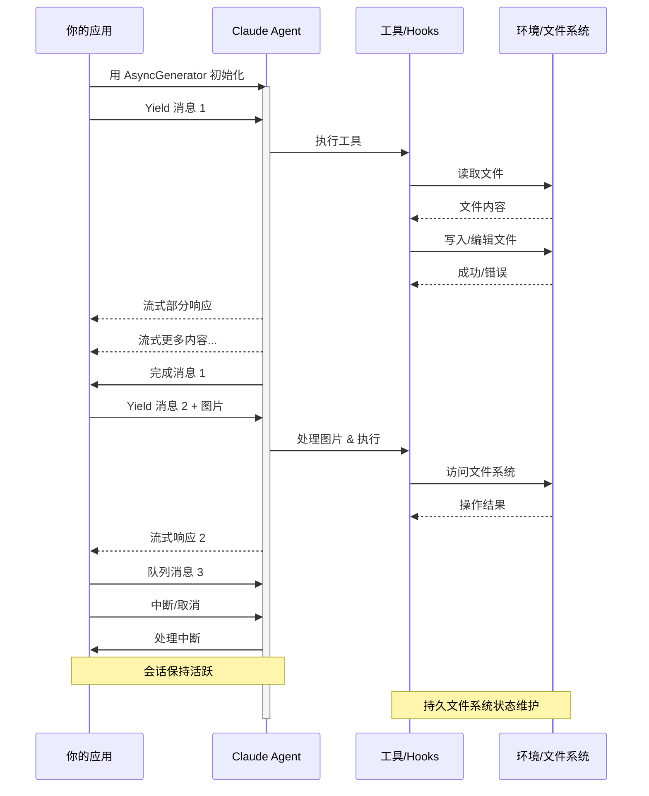

# 流式输入

> 理解 Claude Agent SDK 的两种输入模式及各自适用场景

## 概述

**Claude Agent SDK 支持两种不同的输入模式与 Agent 交互：**

| 模式 | 说明 |
|:---|:---|
| **流式输入模式**（默认且推荐） | 持久的交互式会话 |
| **单消息输入** | 利用会话状态和恢复的一次性查询 |

本指南解释两者的区别、优势和适用场景，帮助你为应用选择合适的方式。

## 流式输入模式（推荐）

**流式输入模式是使用 Claude Agent SDK 的首选方式。** 它提供对 Agent 能力的完整访问，支持丰富的交互体验。

Agent 作为长期存活的进程运行，接收用户输入、处理中断、展示权限请求并管理会话。

### 工作原理



### 优势

| 能力 | 说明 |
|:---|:---|
| 图片上传 | 直接在消息中附加图片进行视觉分析 |
| 消息队列 | 发送多条消息按顺序处理，支持中断 |
| 工具集成 | 会话期间完整访问所有工具和自定义 MCP 服务器 |
| 实时反馈 | 响应生成时即可看到，而非等待最终结果 |
| 上下文持久 | 跨多轮自然维护对话上下文 |

### 实现示例

TypeScript：

```typescript
import { query, type SDKUserMessage } from "@anthropic-ai/claude-agent-sdk";
import { readFile } from "fs/promises";

async function* generateMessages(): AsyncGenerator<SDKUserMessage> {
  // 第一条消息
  yield {
    type: "user",
    message: {
      role: "user",
      content: "Analyze this codebase for security issues"
    },
    parent_tool_use_id: null
  };

  // 等待条件或用户输入
  await new Promise((resolve) => setTimeout(resolve, 2000));

  // 带图片的后续消息
  yield {
    type: "user",
    message: {
      role: "user",
      content: [
        {
          type: "text",
          text: "Review this architecture diagram"
        },
        {
          type: "image",
          source: {
            type: "base64",
            media_type: "image/png",
            data: await readFile("diagram.png", "base64")
          }
        }
      ]
    },
    parent_tool_use_id: null
  };
}

// 处理流式响应
for await (const message of query({
  prompt: generateMessages(),
  options: {
    maxTurns: 10,
    allowedTools: ["Read", "Grep"]
  }
})) {
  if (message.type === "result" && message.subtype === "success") {
    console.log(message.result);
  }
}
```

Python：

```python
from claude_agent_sdk import (
    ClaudeSDKClient,
    ClaudeAgentOptions,
    AssistantMessage,
    TextBlock,
)
import asyncio
import base64


async def streaming_analysis():
    async def message_generator():
        # 第一条消息
        yield {
            "type": "user",
            "message": {
                "role": "user",
                "content": "Analyze this codebase for security issues",
            },
        }

        # 等待条件
        await asyncio.sleep(2)

        # 带图片的后续消息
        with open("diagram.png", "rb") as f:
            image_data = base64.b64encode(f.read()).decode()

        yield {
            "type": "user",
            "message": {
                "role": "user",
                "content": [
                    {"type": "text", "text": "Review this architecture diagram"},
                    {
                        "type": "image",
                        "source": {
                            "type": "base64",
                            "media_type": "image/png",
                            "data": image_data,
                        },
                    },
                ],
            },
        }

    # 使用 ClaudeSDKClient 进行流式输入
    options = ClaudeAgentOptions(max_turns=10, allowed_tools=["Read", "Grep"])

    async with ClaudeSDKClient(options) as client:
        # 发送流式输入
        await client.query(message_generator())

        # 处理响应
        async for message in client.receive_response():
            if isinstance(message, AssistantMessage):
                for block in message.content:
                    if isinstance(block, TextBlock):
                        print(block.text)


asyncio.run(streaming_analysis())
```

> **注意：** 在 TypeScript SDK 中，如果消息生成器抛出异常（例如它读取的文件不存在），流会以 `Claude Code process aborted by user` 错误结束，而非原始错误。因此看到此消息时先检查生成器内部代码。错误前可能有一长行压缩的 SDK 源码，需要读到输出末尾才能看到错误文本。
>
> 在 Python SDK 中，生成器异常会以 debug 级别记录，会话会无提示地挂起。因此如果流式会话无输出地挂起，启用 debug 日志并检查生成器。

## 单消息输入

**单消息输入更简单但功能更有限。**

### 何时使用单消息输入

适用于以下场景：

* 需要一次性响应
* 不需要图片附件或会话中控制方法
* 需要在无状态环境中运行（如 Lambda 函数）

### 限制

> **警告：** 单消息输入模式**不支持**：
>
> * 消息中直接附加图片
> * 动态消息队列
> * 实时中断
> * 自然的多轮对话

如果查询以错误结果结束（如 `error_max_turns`），单消息 `query()` 调用在产出最终结果消息后会抛出错误，因此如果代码需要继续运行，请用 try 块包裹循环。参见[处理结果](https://code.claude.com/docs/en/agent-sdk/agent-loop#handle-the-result)了解结果子类型。

### 实现示例

TypeScript：

```typescript
import { query } from "@anthropic-ai/claude-agent-sdk";

// 简单的一次性查询
for await (const message of query({
  prompt: "Explain the authentication flow",
  options: {
    maxTurns: 1,
    allowedTools: ["Read", "Grep"]
  }
})) {
  if (message.type === "result" && message.subtype === "success") {
    console.log(message.result);
  }
}

// 使用会话管理继续对话
for await (const message of query({
  prompt: "Now explain the authorization process",
  options: {
    continue: true,
    maxTurns: 1
  }
})) {
  if (message.type === "result" && message.subtype === "success") {
    console.log(message.result);
  }
}
```

Python：

```python
from claude_agent_sdk import query, ClaudeAgentOptions, ResultMessage
import asyncio


async def single_message_example():
    # 简单的一次性查询
    async for message in query(
        prompt="Explain the authentication flow",
        options=ClaudeAgentOptions(max_turns=1, allowed_tools=["Read", "Grep"]),
    ):
        if isinstance(message, ResultMessage):
            print(message.result)

    # 使用会话管理继续对话
    async for message in query(
        prompt="Now explain the authorization process",
        options=ClaudeAgentOptions(continue_conversation=True, max_turns=1),
    ):
        if isinstance(message, ResultMessage):
            print(message.result)


asyncio.run(single_message_example())
```
