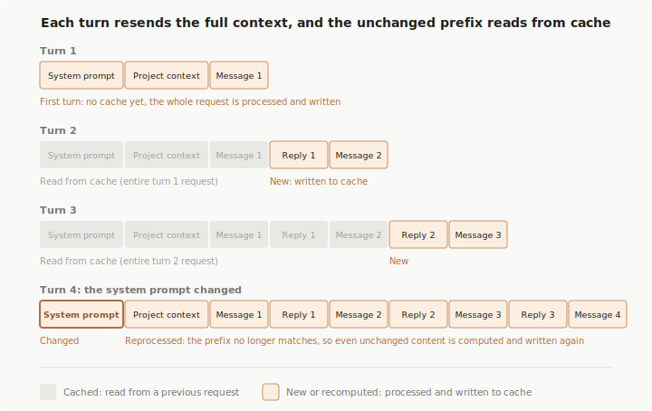

# Claude Code 如何使用 Prompt Caching

> Claude Code 自动管理 prompt caching。了解为什么切换模型会触发一次缓慢的未缓存请求，`/compact` 的代价是什么，为什么 CLAUDE.md 编辑不会在会话中间生效，以及如何检查缓存命中率。

**Prompt caching 让 Claude Code 更快更省。** 没有缓存，API 在每个回合都需要重新处理完整历史。有了缓存，它复用已处理的内容，只对变化部分做新的处理。

Claude Code 自动为你处理 prompt caching，除非你 [禁用它](#禁用-prompt-caching)。了解 prompt caching 的工作方式仍然有用，因为某些操作会使缓存失效，让下一次响应在重建时变得更慢和更贵。本页涵盖哪些操作会导致失效、为什么某些设置需要等到重启才生效，以及在用量看起来偏高时如何检查缓存性能。

## 缓存的组织方式

**每次你在 Claude Code 中发送消息，它都发起一个新的 API 请求。** 模型在请求之间不记住任何东西，因此 Claude Code 重新发送完整上下文：系统提示词、项目上下文、所有之前的消息和工具结果、以及你的新消息。新内容追加在末尾，这意味着每个请求的大部分与前一个相同。Prompt caching 就是 API 避免重新处理未变化部分的方式。

**API 通过将每个请求的开头（称为前缀）与最近处理的内容匹配来缓存。** 在正常回合中，前缀是整个上一个请求，只有最新的交换是新的。匹配是精确的——前缀中任何位置的变化都会导致其后的所有内容重新计算。没有按文件或按片段的缓存。参见 API 参考中的 [prompt caching 工作原理](https://platform.claude.com/docs/en/build-with-claude/prompt-caching#how-prompt-caching-works)。

**为了最大化前缀匹配，Claude Code 将每个请求排序为很少在回合间变化的内容优先：**

| 层 | 内容 | 变化时机 |
| :--- | :--- | :--- |
| 系统提示词 | 核心指令、工具定义、输出样式 | 加载的工具定义集变化，或 Claude Code 升级 |
| 项目上下文 | CLAUDE.md、auto memory、无范围规则 | 会话启动，或 `/clear` 或 `/compact` 之后 |
| 对话 | 你的消息、Claude 的回复、工具结果 | 每个回合 |

**对话层的变化不影响系统提示词和项目上下文的缓存。系统提示词的变化使所有内容失效。**

两个设置不是提示词文本的一部分，但都是缓存键的组成：

- **模型**：每个模型有自己的缓存。切换模型时即使内容相同也会重新计算整个请求。参见 [切换模型](#切换模型)。
- **Effort 级别**：每个 effort 级别对同一模型有自己的缓存。中途更改会重新计算整个请求，Claude Code 在应用之前会要求确认。参见 [更改 effort 级别](#更改-effort-级别)。

> [!TIP]
> 在会话开始时选好模型和 effort 级别，然后将 `/compact` 留到任务间的自然间歇。任务中间做的变更越少，缓存命中率越高。

### 缓存存储位置

**缓存发生在服务端，在为你的模型提供服务的基础设施中。** 具体位置取决于你的认证方式：

| 认证方式 | 缓存位置 |
| :--- | :--- |
| API key、Claude 订阅或 [Claude Platform on AWS](https://code.claude.com/docs/en/claude-platform-on-aws) | Anthropic 的基础设施，通过 [Claude API](https://platform.claude.com/docs) 访问 |
| Bedrock 或 Vertex AI | 你的云提供商的推理基础设施 |
| Foundry | 请求路由到 Anthropic 的基础设施 |
| 自定义 `ANTHROPIC_BASE_URL` 或 [LLM gateway](https://code.claude.com/docs/en/llm-gateway) | 请求转发到的任何地方，缓存是否生效取决于网关 |

关于各提供商存储和处理什么，参见 [Data usage](https://code.claude.com/docs/en/data-usage)。无论缓存在哪里，条目在一段时间不活动后过期，[缓存生命周期](#缓存生命周期) 部分涵盖 TTL 及如何延长。

## 使缓存失效的操作

**这些操作导致下一个请求部分或全部缓存未命中。** 你会看到一次性的较慢、较贵的回合，之后新前缀被缓存。大多数在你知道有代价后可以在任务中间避免。

- [切换模型](#切换模型)
- [更改 effort 级别](#更改-effort-级别)
- [开启 fast mode](#开启-fast-mode)
- [连接或断开 MCP 服务器](#连接或断开-mcp-服务器)
- [启用或禁用插件](#启用或禁用插件)
- [拒绝整个工具](#拒绝整个工具)
- [压缩对话](#压缩对话)
- [升级 Claude Code](#升级-claude-code)

### 切换模型

**每个模型有自己的缓存。** 用 [`/model`](https://code.claude.com/docs/en/model-config#setting-your-model) 切换意味着下一个请求读取整个对话历史而没有缓存命中，即使内容相同。

[`opusplan` 模型设置](https://code.claude.com/docs/en/model-config#opusplan-model-setting) 在 plan mode 期间解析为 Opus，在执行期间解析为 Sonnet，因此每次 plan-mode 切换都是一次模型切换并启动新的缓存。

Fable 5 上的 [自动模型回退](https://code.claude.com/docs/en/model-config#automatic-model-fallback) 也是模型切换。当安全分类器标记一个请求时，Claude Code 在默认 Opus 模型上重新运行它，会话继续在那里。

### 更改 effort 级别

**缓存同时以 [effort 级别](https://code.claude.com/docs/en/model-config#adjust-effort-level) 和模型为键。** 用 `/effort` 切换意味着下一个请求没有缓存命中。对话开始后，Claude Code 在应用会使缓存失效的 effort 变更前显示确认对话框。解析为当前已生效级别的变更会跳过对话框并保持缓存。

### 开启 fast mode

**启用 [fast mode](https://code.claude.com/docs/en/fast-mode) 添加一个作为缓存键一部分的请求头。** 下一个请求没有缓存命中。那些未缓存的输入 token 按 [fast mode 费率](https://code.claude.com/docs/en/fast-mode#understand-the-cost-tradeoff) 计费，这就是为什么在长对话深处开启比在会话开始时开启成本更高。从非 Opus 模型启用 fast mode 还会 [切换模型](#切换模型)。

费用每个对话只发生一次。第一个 fast mode 回合后，Claude Code 持续发送该头，只改变请求的 speed 设置（不是缓存键的一部分）。关闭 fast mode、[速率限制后的自动回退](https://code.claude.com/docs/en/fast-mode#handle-rate-limits)、以及之后重新开启都保持缓存。`/clear` 和 `/compact` 重置这个，因为它们在那些点本就要重建缓存。

> [!NOTE]
> 在切换间保持头需要 Claude Code v2.1.86 或更高版本。在更早版本上，每次 fast mode 切换和速率限制回退都会使缓存失效。

### 连接或断开 MCP 服务器

**工具定义位于系统提示词层**，因此当请求中的工具定义集在回合间变化时缓存失效。[MCP 服务器](https://code.claude.com/docs/en/mcp) 变更是否导致失效取决于其工具是被 [tool search](https://code.claude.com/docs/en/mcp#scale-with-mcp-tool-search) 延迟加载还是加载到前缀中：

- **延迟加载的工具**（支持模型的默认行为）：服务器连接、断开或更改工具列表只追加新内容，不扰动已缓存的内容。
- **加载到前缀中的工具**：任何变更都使缓存失效。这发生在 [tool search 不可用或被禁用](https://code.claude.com/docs/en/mcp#configure-tool-search) 时（如 Haiku 模型、Vertex AI 上、或使用自定义网关时），或标记为 [`alwaysLoad`](https://code.claude.com/docs/en/mcp#exempt-a-server-from-deferral) 的服务器/工具。

切换 [advisor 工具](https://code.claude.com/docs/en/advisor) 是例外：其定义位于缓存断点之后，因此启用或禁用 `/advisor` 保持缓存完整。

### 启用或禁用插件

**[插件](https://code.claude.com/docs/en/plugins) 捆绑多种组件类型**，变更的代价取决于插件提供哪些组件。Skills、commands、agents、hooks、LSP 服务器、monitors 和 themes 永远不会使缓存失效——它们添加到请求的内容追加在现有对话之后。

例外是提供 [MCP 服务器](https://code.claude.com/docs/en/plugins-reference#mcp-servers) 的插件。启用或禁用一个遵循与 [连接或断开 MCP 服务器](#连接或断开-mcp-服务器) 相同的规则。

插件变更在你运行 [`/reload-plugins`](https://code.claude.com/docs/en/discover-plugins#apply-plugin-changes-without-restarting) 或启动新会话时生效。从 v2.1.163 起，当重新加载会触发完全重新读取时，`/reload-plugins` 显示警告且不应用重新加载。传 `--force` 强制应用。

### 拒绝整个工具

**添加裸工具名（如 `Bash` 或 `WebFetch`）作为 [deny 规则](https://code.claude.com/docs/en/permissions#manage-permissions) 会将该工具从 Claude 的上下文中完全移除。** 内置工具定义加载到系统提示词层，因此在会话中间添加或移除这些规则会使缓存失效。

只有在工具名位置匹配的 deny 规则有此效果：裸工具名、等效的 `Bash(*)` 形式、或 [工具名通配符](https://code.claude.com/docs/en/permissions#tool-name-wildcards)。有范围的 deny 规则（如 `Bash(rm *)`）和所有 allow/ask 规则不会改变 Claude 看到的工具，保持前缀完整。

### 压缩对话

**[压缩](https://code.claude.com/docs/en/context-window#what-survives-compaction) 用摘要替换消息历史。** 设计上这会使对话层失效，因为下一个请求有新的、更短的历史不与旧的共享前缀。Claude Code 复用系统提示词层并从磁盘重新加载项目上下文（仅在 CLAUDE.md 和 memory 自会话开始以来未更改时缓存命中）。

要生成摘要，Claude Code 发送一个与你对话相同系统提示词、工具和历史的一次性请求，加上作为最终用户消息追加的摘要指令。因为它共享你的前缀，该请求读取现有缓存而非重新处理完整历史。压缩的大部分时间花在生成摘要上，而非缓存未命中。

> [!TIP]
> 压缩在你丢弃不再需要的内容时对你有利。要控制其开销何时发生，在工作的自然间歇（如任务之间）运行 `/compact`，而非等待自动压缩在任务中间触发。如果你想完全放弃一条路径，用 [`/rewind`](#回退对话) 回到更早的回合——回退截断到已缓存的前缀，而非像压缩那样构建新的。

### 升级 Claude Code

**新的 Claude Code 版本通常更新系统提示词或工具定义**，因此升级后的第一个请求从头重建缓存。[自动更新](https://code.claude.com/docs/en/setup#auto-updates) 在后台下载新版本但在下次启动时应用，从不在会话中间，因此你看到这是重启后的一次未缓存首回合而非会话中的意外。设置 `DISABLE_AUTOUPDATER=1` 控制升级应用时机。

> [!NOTE]
> 升级后 [恢复会话](https://code.claude.com/docs/en/sessions#resume-a-session) 会重新处理整个对话历史而没有缓存命中，因为历史现在位于不同系统提示词之后。代价与恢复的对话长度成正比，因此回到长会话的第一个回合可能是你发送的最贵请求。

## 保持缓存的操作

**这些操作要么追加到对话末尾，要么完全不触碰请求。** 其中一些（如编辑 CLAUDE.md 或更改输出样式）也是设置变更为什么等到重启才生效的原因。

- [编辑仓库中的文件](#编辑仓库中的文件)
- [会话中间编辑 CLAUDE.md](#会话中间编辑-claudemd)
- [更改输出样式](#更改输出样式)
- [更改权限模式](#更改权限模式)
- [调用 skills 和 commands](#调用-skills-和-commands)
- [运行 /recap](#运行-recap)
- [回退对话](#回退对话)
- [派生子 agent](#子-agent-与缓存)

### 编辑仓库中的文件

**文件内容仅在 Claude 读取时进入上下文，读取会追加到对话。** 编辑 Claude 之前读取过的文件不会追溯更改历史中的早期读取。Claude Code 会追加一个 `<system-reminder>` 标注文件已更改，Claude 在需要时重新读取。

### 会话中间编辑 CLAUDE.md

**项目根目录和用户级 CLAUDE.md 文件在会话启动时读取一次并保持在内存中。** 中途编辑不会使缓存失效，但编辑也不会生效。Claude 继续使用会话启动时加载的版本。新内容在下次 `/clear`、`/compact` 或重启时加载。

[子目录中的嵌套 CLAUDE.md 文件](https://code.claude.com/docs/en/memory) 和带 [`paths:` frontmatter 的规则](https://code.claude.com/docs/en/memory#path-specific-rules) 在 Claude 首次读取匹配文件时才加载。在加载前编辑会生效。加载后内容成为对话历史的一部分，中途编辑不会追溯更改。

### 更改输出样式

**[输出样式](https://code.claude.com/docs/en/output-styles) 是系统提示词的一部分**，Claude Code 在会话启动时读取一次。中途通过 `/config` 或 `outputStyle` 设置更改不会使缓存失效，但更改也不会生效。新样式在下次 `/clear` 或重启时加载。

### 更改权限模式

**在 [权限模式](https://code.claude.com/docs/en/permission-modes) 间切换不会改变系统提示词或工具定义**，因此模式切换对缓存安全。例外是使用 [`opusplan`](https://code.claude.com/docs/en/model-config#opusplan-model-setting) 模型设置的 plan mode，它在进入或离开 plan mode 时在 Opus 和 Sonnet 之间切换模型，使模式切换成为 [模型切换](#切换模型)。

### 调用 skills 和 commands

**[Skills](https://code.claude.com/docs/en/skills) 和 [commands](https://code.claude.com/docs/en/commands) 在调用点将指令作为用户消息注入。** 对话中更早的内容不变。

### 运行 /recap

**[`/recap`](https://code.claude.com/docs/en/interactive-mode#session-recap) 生成摘要显示在终端中。** 与 `/compact` 不同，它将摘要作为命令输出追加而非替换消息历史，因此缓存前缀保持完整。

### 回退对话

**[`/rewind`](https://code.claude.com/docs/en/checkpointing) 将对话截断回更早的回合。** 剩余历史与该点构建缓存时的内容相同，系统提示词和项目上下文层不变，因此下一个请求命中更早的缓存条目。自那以后的每个回合都读取过该前缀，使条目保持活跃——即使原始回合比 TTL 更久远。

随对话恢复文件检查点对缓存没有额外影响。文件内容仅在 Claude 读取时进入上下文。

## 缓存生命周期

**缓存前缀在一段时间不活动后过期。** 每个命中缓存的请求重置计时器，因此只要你继续工作缓存就保持活跃。足够长的间隙后，下一个请求重新计算完整输入并重建缓存，这就是为什么离开后回来的第一个回合明显更慢。

**TTL 控制缓存能存活多长间隙。** API 提供两种：5 分钟 TTL 和 [1 小时 TTL](https://platform.claude.com/docs/en/build-with-claude/prompt-caching#1-hour-cache-duration)（通过更长间歇保持缓存活跃但 [缓存写入按更高费率计费](https://platform.claude.com/docs/en/build-with-claude/prompt-caching#pricing)）。Claude Code 根据你的认证方式自动选择 TTL，你可以用环境变量覆盖。

### Claude 订阅用户

**Claude 订阅上，Claude Code 自动请求 1 小时 TTL。** 用量包含在你的计划中而非按 token 计费，因此更长 TTL 不会额外收费，只影响缓存保持活跃的时间。

如果你超过计划的用量限制，Claude Code 使用 [用量积分](https://support.claude.com/en/articles/12429409-extra-usage-for-paid-claude-plans)，你需要为该用量付费，Claude Code 自动将 TTL 降到 5 分钟。

### API key 或第三方提供商

**使用 API key、Bedrock、Vertex、Foundry 或 Claude Platform on AWS 时，按 token 费率付费**，因此 TTL 默认为更便宜的 5 分钟。要启用 [1 小时 TTL](https://platform.claude.com/docs/en/build-with-claude/prompt-caching#1-hour-cache-duration)，设置 `ENABLE_PROMPT_CACHING_1H=1`。

在 Bedrock 上，prompt caching 支持、最小可缓存前缀长度和 1 小时 TTL 可用性因模型而异。如果缓存 token 计数保持为零，检查 Bedrock 文档中的 [支持的模型、区域和限制](https://docs.aws.amazon.com/bedrock/latest/userguide/prompt-caching.html#prompt-caching-models)。

### 覆盖 TTL

设置 `FORCE_PROMPT_CACHING_5M=1` 无论认证方式都强制 5 分钟 TTL。适用于调试缓存行为、比较两种 TTL、或覆盖 [managed settings](https://code.claude.com/docs/en/settings#settings-files) 中设置的 `ENABLE_PROMPT_CACHING_1H`。

## 缓存作用域

**在 Claude Code 中，缓存实际上限定在一台机器和目录。** 系统提示词嵌入工作目录、平台、shell、OS 版本和 auto-memory 路径，因此不同目录的两个会话构建不同前缀并互相缓存未命中。这包括同一仓库的 worktrees，因为每个 worktree 有自己的工作目录。

**在同一目录中并行运行的会话构建匹配的前缀并读取彼此的缓存。** 顺序会话仅在启动时的 git status 快照匹配时共享前缀（因为系统提示词也捕获分支和最近提交）。

底层 API 缓存更广泛。缓存在组织间隔离，在某些提供商上在 [组织内的工作空间间](https://platform.claude.com/docs/en/build-with-claude/prompt-caching#cache-storage-and-sharing) 隔离。在这些边界内，任何两个具有相同模型和前缀的请求读取相同缓存。对于运行自动化进程集群的 Agent SDK 调用者，参见 [改善跨用户和机器的 prompt caching](https://code.claude.com/docs/en/agent-sdk/modifying-system-prompts#improve-prompt-caching-across-users-and-machines) 以抑制系统提示词的每台机器部分并跨机器共享缓存。

## 检查缓存性能

**缓存性能表现为 API 在每次响应中报告的两个 token 计数。** 实时观察的最直接方式是 [statusline 脚本](https://code.claude.com/docs/en/statusline) 读取 `current_usage` 对象：

| 字段 | 含义 |
| :--- | :--- |
| `cache_creation_input_tokens` | 此回合写入缓存的 token，按缓存写入费率计费 |
| `cache_read_input_tokens` | 此回合从缓存提供的 token，按约标准输入费率 10% 计费 |

**read-to-creation 比率高意味着缓存工作良好。** 如果 creation 每回合都保持高值，说明前缀中有东西在变化。[使缓存失效的操作](#使缓存失效的操作) 部分列出了常见原因。

要在组织范围内可见，OpenTelemetry 导出器按用户和会话报告缓存读取和创建 token。参见 [Monitor usage](https://code.claude.com/docs/en/monitoring-usage) 获取指标和事件属性参考。

## 子 Agent 与缓存

**[子 agent](https://code.claude.com/docs/en/sub-agents) 以自己的系统提示词和工具集开始独立对话**，与父 agent 分离。它构建自己的缓存，首次调用时没有缓存命中，在自己的回合间逐渐预热。子 agent 使用 5 分钟 TTL（即使在订阅上），因为自动 1 小时 TTL 仅适用于主对话。

**父 agent 的缓存不受影响。** 从父 agent 角度看，子 agent 的调用和结果追加到对话，保持父 agent 的前缀完整。

[Fork](https://code.claude.com/docs/en/sub-agents#fork-the-current-conversation) 则完全继承父 agent 的系统提示词、工具和对话历史，因此其第一个请求读取父 agent 的缓存。[压缩对话](#压缩对话) 中描述的压缩摘要调用使用相同的前缀共享方式。

## 禁用 Prompt Caching

**禁用缓存偶尔在调试特定模型或提供商的缓存行为时有用。** 要关闭，将以下环境变量之一设为 `1`：

| 变量 | 效果 |
| :--- | :--- |
| `DISABLE_PROMPT_CACHING` | 对所有模型禁用 |
| `DISABLE_PROMPT_CACHING_HAIKU` | 仅对 Haiku 禁用 |
| `DISABLE_PROMPT_CACHING_SONNET` | 仅对 Sonnet 禁用 |
| `DISABLE_PROMPT_CACHING_OPUS` | 仅对 Opus 禁用 |
| `DISABLE_PROMPT_CACHING_FABLE` | 仅对 Fable 禁用 |

要在组织范围设置缓存策略，将这些或 [TTL 变量](#缓存生命周期) 放入 [managed settings](https://code.claude.com/docs/en/settings#settings-files) 的 `env` 块。正常使用时保持缓存启用。

## 相关资源

- [Lessons from building Claude Code: Prompt caching is everything](https://claude.com/blog/lessons-from-building-claude-code-prompt-caching-is-everything)：plan mode、延迟工具加载和压缩的设计理念
- [Explore the context window](https://code.claude.com/docs/en/context-window)：什么加载到上下文以及何时加载
- [Reduce token usage](https://code.claude.com/docs/en/costs#reduce-token-usage)：缓存之外管理上下文大小的策略
- [Track and reduce costs](https://code.claude.com/docs/en/agent-sdk/cost-tracking)：Agent SDK 调用者的缓存 token 跟踪和 TTL 配置
- [Prompt caching](https://platform.claude.com/docs/en/build-with-claude/prompt-caching)：底层 API 机制、断点和定价
