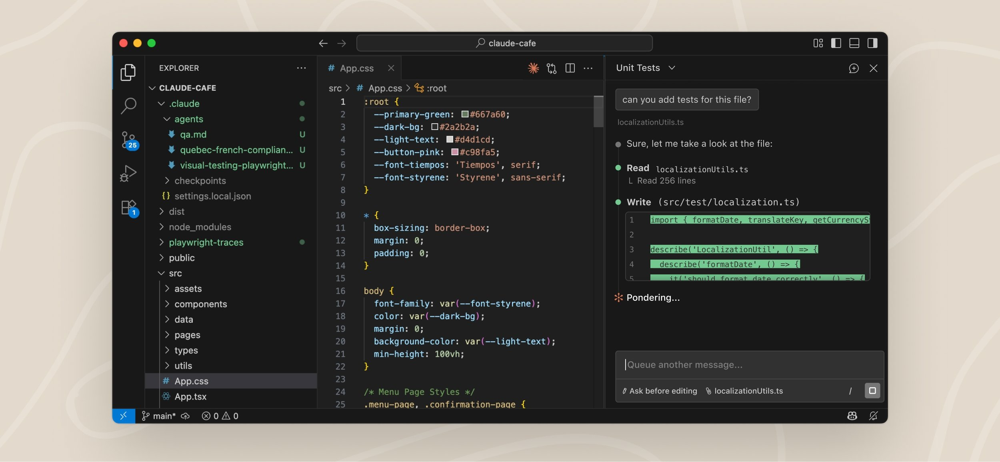
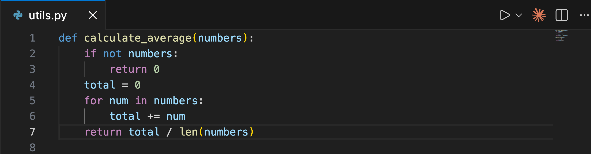
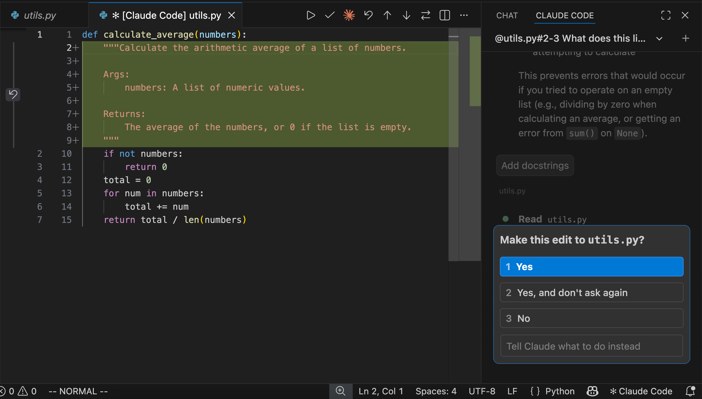

# 在 VS Code 中使用 Claude Code

> 安装并配置 VS Code 的 Claude Code 扩展。获得内联 diff、@-mentions、计划审查、快捷键等 AI 编码辅助能力。



**VS Code 扩展提供原生图形界面，直接嵌入 IDE。** 这是在 VS Code 中使用 Claude Code 的推荐方式。

通过该扩展，你可以在接受修改前审查和编辑 Claude 的计划、自动接受编辑、用 @-mention 引用指定行范围的文件、访问对话历史，以及在多个标签页或窗口中打开独立对话。

## 前置条件

安装前，请确认：

- VS Code 1.98.0 或更高版本
- 一个 Anthropic 账户：任何 Claude 付费订阅（Pro、Max、Team 或 Enterprise）或 Claude Console 账户均可，无需 API Key。首次打开扩展时会要求[登录](https://code.claude.com/docs/en/authentication#log-in-to-claude-code)。如果你通过 Amazon Bedrock 或 Google Vertex AI 等第三方服务商访问 Claude，请参考[使用第三方服务商](#使用第三方服务商)进行配置。

> **提示：** 扩展自带了一份 CLI（命令行）用于聊天面板。如果你想在 VS Code 集成终端中运行 `claude` 命令，还需要[单独安装 CLI](https://code.claude.com/docs/en/setup)。详见 [VS Code 扩展 vs. CLI](#vs-code-扩展-vs-claude-code-cli)。

## 安装扩展

点击以下链接直接安装：

- [为 VS Code 安装](vscode:extension/anthropic.claude-code)
- [为 Cursor 安装](cursor:extension/anthropic.claude-code)

或者在 VS Code 中按 `Cmd+Shift+X`（Mac）/ `Ctrl+Shift+X`（Windows/Linux）打开扩展视图，搜索 "Claude Code"，点击 **Install**。

该扩展也可以在 Devin Desktop、Kiro 等 VS Code 分支中安装。在编辑器的扩展视图中搜索 "Claude Code"，或从 [Open VSX Registry](https://open-vsx.org/extension/Anthropic/claude-code) 安装。如果你的编辑器无法安装扩展，请[安装 CLI](https://code.claude.com/docs/en/quickstart) 并在集成终端中运行 `claude`。CLI 可在任何终端中使用。

> **注意：** 安装后如未显示扩展，请重启 VS Code 或在命令面板中执行 "Developer: Reload Window"。

## 快速开始

安装完成后，即可通过 VS Code 界面使用 Claude Code：

### 第一步：打开 Claude Code 面板

**Spark 图标是 Claude Code 在 VS Code 中的统一标识：** 

最快的方式是点击**编辑器工具栏**（编辑器右上角）的 Spark 图标。该图标仅在打开文件时显示。



其他打开方式：

- **活动栏**：点击左侧边栏的 Spark 图标，打开会话列表。点击任何会话以编辑器标签页形式打开，或新建一个。该图标始终可见。
- **命令面板**：`Cmd+Shift+P`（Mac）/ `Ctrl+Shift+P`（Windows/Linux），输入 "Claude Code"，选择 "Open in New Tab" 等选项。
- **状态栏**：点击窗口右下角的 **Claude Code**。即使没有打开文件也可使用。

你可以拖动 Claude 面板到 VS Code 中的任意位置。详见[自定义工作流](#自定义工作流)。

### 第二步：登录

首次打开面板时会出现登录界面。点击 **Sign in** 并在浏览器中完成授权。

如果之后看到 **Not logged in - Please run /login**，扩展会自动重新打开登录界面。如果没有弹出，请在命令面板中执行 **Developer: Reload Window**。

如果你在 shell 中设置了 `ANTHROPIC_API_KEY` 但仍看到登录提示，可能是 VS Code 没有继承你的 shell 环境。从终端用 `code .` 启动 VS Code 以继承环境变量，或直接用 Claude 账户登录。

登录后会出现 **Learn Claude Code** 清单。逐项点击 **Show me** 学习，或用 X 关闭。如需重新打开，在 VS Code 设置中取消勾选 Extensions - Claude Code 下的 **Hide Onboarding**。

### 第三步：发送提示

向 Claude 提问关于代码或文件的问题，无论是解释工作原理、调试问题还是修改代码。

> **提示：** Claude 会自动看到你选中的文本。按 `Option+K`（Mac）/ `Alt+K`（Windows/Linux）可插入 @-mention 引用（如 `@file.ts#5-10`）到提示中。

下面是询问文件中特定行的示例：


### 第四步：审查修改

**Claude 修改文件时会展示并排对比视图，等待你确认。** 你可以接受、拒绝或告诉 Claude 如何修改。如果你在接受前直接编辑了 diff 视图中的内容，Claude 会知道你做了修改，不会假设文件与其原始提案一致。



更多用法请参考 [常见工作流](https://code.claude.com/docs/en/common-workflows)。

> **提示：** 在命令面板中执行 "Claude Code: Open Walkthrough" 可获得基础功能的引导式教程。

## 使用提示框

提示框支持以下功能：

| 功能 | 说明 |
|------|------|
| **权限模式** | 点击提示框底部的模式指示器切换。Normal 模式下 Claude 每次操作前请求权限；Plan 模式下 Claude 描述计划并等待批准后才修改（VS Code 会自动以 Markdown 文档打开计划，你可以添加行内评论作为反馈）；Auto-accept 模式下 Claude 直接修改不询问。默认模式可在设置 `claudeCode.initialPermissionMode` 中配置。 |
| **命令菜单** | 点击 `/` 或输入 `/` 打开命令菜单。选项包括附加文件、切换模型、开关扩展思维、查看用量（`/usage`）、启动 [远程控制](https://code.claude.com/docs/en/remote-control) 会话（`/remote-control`）。"Customize" 部分可访问 MCP 服务器、Hooks、Memory、权限和插件。带终端图标的项会在集成终端中打开。 |
| **上下文指示器** | 提示框显示当前使用了 Claude 上下文窗口的多少容量。满时 Claude 会自动压缩，你也可以手动执行 `/compact`。 |
| **扩展思维** | 让 Claude 花更多时间推理复杂问题。通过命令菜单（`/`）开启。推理过程以折叠块形式出现在对话中：点击展开阅读，或按 `Ctrl+O` 全部展开/折叠。详见 [扩展思维](https://code.claude.com/docs/en/model-config#extended-thinking)。 |
| **多行输入** | 按 `Shift+Enter` 换行而不发送。问答对话框的 "Other" 文本输入同样适用。 |

### 引用文件和文件夹

**用 @-mentions 为 Claude 提供特定文件或文件夹的上下文。** 输入 `@` 后跟文件或文件夹名，Claude 会读取内容并据此回答问题或修改代码。支持模糊匹配，输入部分名称即可：

```text
> Explain the logic in @auth（模糊匹配 auth.js、AuthService.ts 等）
> What's in @src/components/（文件夹需要尾部斜杠）
```

对于大型 PDF，可以要求 Claude 只读取特定页面：单页、页码范围（如 1-10 页）或开放范围（如第 3 页起）。

在编辑器中选中文本时，Claude 能自动看到高亮代码。提示框底部会显示选中行数。按 `Option+K`（Mac）/ `Alt+K`（Windows/Linux）插入带文件路径和行号的 @-mention（如 `@app.ts#5-10`）。点击选区指示器可切换 Claude 是否能看到高亮文本——眼睛划线图标表示选区对 Claude 隐藏。

你也可以按住 `Shift` 拖拽文件到提示框中作为附件。点击附件上的 X 可从上下文中移除。

### 恢复历史对话

**点击 Claude Code 面板顶部的 Session history 按钮访问对话历史。** 可按关键字搜索或按时间浏览（今天、昨天、最近 7 天等）。点击任意对话即可恢复完整消息历史。新会话会基于你的第一条消息自动生成 AI 标题。悬停在会话上可显示重命名和删除操作。更多信息请参考 [管理会话](https://code.claude.com/docs/en/sessions)。

### 从 Claude.ai 恢复云端会话

如果你使用 [网页版 Claude Code](https://code.claude.com/docs/en/claude-code-on-the-web)，可以直接在 VS Code 中恢复那些云端会话。需要使用 **Claude.ai Subscription** 登录，而非 Anthropic Console。

1. 点击 Claude Code 面板顶部的 **Session history** 按钮
2. 对话框显示两个标签：Local 和 Remote。点击 **Remote** 查看 claude.ai 的会话
3. 浏览或搜索云端会话，点击下载并在本地继续对话

> **注意：** 只有关联了 GitHub 仓库的网页会话才会出现在 Remote 标签中。恢复操作是将对话历史下载到本地，修改不会同步回 claude.ai。

### 查看账户和用量

**在命令菜单中执行 `/usage` 打开 Account & usage 对话框。** 显示已登录账户、套餐、当前会话和本周的用量进度条及重置时间。

对话框还会分解影响套餐限额的因素。标记占近期用量 10% 以上的行为（如缓存未命中、长上下文、大量子代理或高并行会话），并附带优化建议。归因表格展示各 skill、subagent、插件和 MCP 服务器贡献的用量。需要 Claude Code v2.1.174 或更高版本。

使用 Day 和 Week 切换查看最近 24 小时或最近 7 天的数据。数字为近似值，基于本机的本地会话计算，不包含其他设备或 claude.ai 的用量。更多关于追踪和降低用量的内容请参考 [追踪费用](https://code.claude.com/docs/en/costs#track-your-costs)。

## 自定义工作流

上手之后，你可以重新定位 Claude 面板、运行多个会话或切换到终端模式。

### 选择 Claude 的位置

**拖动 Claude 面板到 VS Code 中的任意位置。** 抓住面板的标签或标题栏，拖到：

| 位置 | 说明 |
|------|------|
| 副侧边栏 | 窗口右侧。编码时保持 Claude 可见。 |
| 主侧边栏 | 左侧边栏，与 Explorer、Search 等图标并列。 |
| 编辑器区域 | 作为标签页与文件并排。适合处理辅助任务。 |

> **提示：** 用侧边栏放主会话，用额外标签页处理辅助任务。Claude 会记住你的偏好位置。活动栏中的会话列表图标与 Claude 面板是分开的：会话列表始终可见，而 Claude 面板图标仅在面板停靠在左侧边栏时才出现在活动栏中。

### 运行多个对话

**通过命令面板的 "Open in New Tab" 或 "Open in New Window" 启动额外对话。** 每个对话维护独立的历史和上下文，允许你并行处理不同任务。

使用标签页时，Spark 图标上的小圆点指示状态：蓝色表示有权限请求等待处理，橙色表示 Claude 在标签页隐藏时已完成。

### 切换到终端模式

**扩展默认打开图形聊天面板。** 如果你偏好 CLI 风格界面，打开 [Use Terminal 设置](vscode://settings/claudeCode.useTerminal) 并勾选。

也可以打开 VS Code 设置（Mac 上 `Cmd+,`，Windows/Linux 上 `Ctrl+,`），找到 Extensions - Claude Code，勾选 **Use Terminal**。

## 管理插件

**VS Code 扩展提供图形界面来安装和管理[插件](https://code.claude.com/docs/en/plugins)。** 在提示框中输入 `/plugins` 打开 **Manage plugins** 界面。

### 安装插件

插件对话框有两个标签：**Plugins** 和 **Marketplaces**。

在 Plugins 标签中：

- **已安装插件**在顶部显示，带有启用/禁用开关
- **可用插件**来自已配置的市场，显示在下方
- 搜索可按名称或描述过滤
- 点击 **Install** 安装可用插件

安装时选择作用范围：

| 范围 | 说明 |
|------|------|
| Install for you | 在你的所有项目中可用（用户范围） |
| Install for this project | 与项目协作者共享（项目范围） |
| Install locally | 仅限你在当前仓库使用（本地范围） |

### 管理市场

切换到 **Marketplaces** 标签添加或移除插件来源：

- 输入 GitHub 仓库、URL 或本地路径添加新市场
- 点击刷新图标更新市场的插件列表
- 点击垃圾桶图标移除市场

修改后会出现提示横幅，重启 Claude Code 以应用更新。

> **注意：** VS Code 中的插件管理底层使用相同的 CLI 命令。在扩展中配置的插件和市场在 CLI 中同样可用，反之亦然。

更多插件系统信息请参考 [插件](https://code.claude.com/docs/en/plugins) 和 [插件市场](https://code.claude.com/docs/en/plugin-marketplaces)。

## 用 Chrome 自动化浏览器任务

**将 Claude 连接到 Chrome 浏览器，在不离开 VS Code 的情况下测试 Web 应用、调试控制台日志、自动化浏览器工作流。** 需要 [Claude in Chrome 扩展](https://chromewebstore.google.com/detail/claude/fcoeoabgfenejglbffodgkkbkcdhcgfn) 1.0.36 或更高版本。

在提示框中输入 `@browser` 加上你想让 Claude 做的事情：

```text
@browser go to localhost:3000 and check the console for errors
```

也可以通过附件菜单选择特定浏览器工具，如打开新标签页或读取页面内容。

Claude 在新标签页中执行浏览器任务，共享你的浏览器登录状态，可以访问你已登录的任何站点。

设置说明、完整功能列表和故障排除请参考 [通过 Chrome 使用 Claude Code](https://code.claude.com/docs/en/chrome)。

## VS Code 命令与快捷键

**打开命令面板（Mac 上 `Cmd+Shift+P`，Windows/Linux 上 `Ctrl+Shift+P`），输入 "Claude Code" 查看所有可用命令。**

部分快捷键取决于哪个面板处于焦点状态（接收键盘输入）。光标在代码文件中时，编辑器处于焦点；光标在 Claude 提示框中时，Claude 处于焦点。用 `Cmd+Esc` / `Ctrl+Esc` 在两者之间切换。

> **注意：** 这些是控制扩展的 VS Code 命令。并非所有 Claude Code 内置命令都在扩展中可用。详见 [VS Code 扩展 vs. CLI](#vs-code-扩展-vs-claude-code-cli)。

| 命令 | 快捷键 | 说明 |
|------|--------|------|
| Focus Input | `Cmd+Esc`（Mac）/ `Ctrl+Esc`（Windows/Linux） | 在编辑器和 Claude 之间切换焦点 |
| Open in Side Bar | - | 在左侧边栏中打开 Claude |
| Open in Terminal | - | 以终端模式打开 Claude |
| Open in New Tab | `Cmd+Shift+Esc`（Mac）/ `Ctrl+Shift+Esc`（Windows/Linux） | 在编辑器标签页中打开新对话 |
| Open in New Window | - | 在独立窗口中打开新对话 |
| New Conversation | `Cmd+N`（Mac）/ `Ctrl+N`（Windows/Linux） | 开始新对话。需要 Claude 处于焦点且 `enableNewConversationShortcut` 设为 `true` |
| Reopen Closed Session | `Cmd+Shift+T`（Mac）/ `Ctrl+Shift+T`（Windows/Linux） | 重新打开最近关闭的 Claude 会话标签页。如果最后关闭的不是 Claude 会话，则回退到 VS Code 默认的重新打开行为。可通过 `enableReopenClosedSessionShortcut` 禁用 |
| Insert @-Mention Reference | `Option+K`（Mac）/ `Alt+K`（Windows/Linux） | 插入当前文件和选区的引用（需要编辑器处于焦点） |
| Show Logs | - | 查看扩展调试日志 |
| Logout | - | 退出 Anthropic 账户 |

### 从其他工具启动 VS Code 标签页

**扩展注册了 URI 处理器 `vscode://anthropic.claude-code/open`。** 可用于从 shell 别名、浏览器书签或任何能打开 URL 的脚本启动新的 Claude Code 标签页。如果 VS Code 尚未运行，打开该 URL 会先启动它。如果已在运行，URL 会在当前焦点窗口中打开。

用操作系统的 URL 打开工具调用：

**macOS：**

```bash
open "vscode://anthropic.claude-code/open"
```

**Linux：**

```bash
xdg-open "vscode://anthropic.claude-code/open"
```

**Windows（PowerShell）：**

```powershell
Start-Process "vscode://anthropic.claude-code/open"
```

**Windows（cmd.exe）：**`start` 会把第一个带引号的参数当窗口标题，所以需要传一个空标题：

```cmd
start "" "vscode://anthropic.claude-code/open"
```

该处理器接受两个可选查询参数：

| 参数 | 说明 |
|------|------|
| `prompt` | 预填充到提示框的文本。需要 URL 编码。预填充但不会自动提交。 |
| `session` | 要恢复的会话 ID，而非新建对话。该会话必须属于当前 VS Code 打开的工作区。如果找不到，则新建对话。如果该会话已在标签页中打开，则聚焦该标签页。如需程序化获取会话 ID，参见 [继续对话](https://code.claude.com/docs/en/headless#continue-conversations)。 |

示例——打开预填充 "review my changes" 的标签页：

```text
vscode://anthropic.claude-code/open?prompt=review%20my%20changes
```

如果想启动终端会话而非 VS Code 标签页，请使用 CLI 的 `claude-cli://` 处理器。参见 [通过链接启动会话](https://code.claude.com/docs/en/deep-links)。

## 配置设置

扩展有两类设置：

- **VS Code 扩展设置**：控制扩展在 VS Code 中的行为。打开方式：`Cmd+,`（Mac）/ `Ctrl+,`（Windows/Linux），找到 Extensions - Claude Code。也可输入 `/` 选择 **General Config** 打开设置。
- **Claude Code 设置** 位于 `~/.claude/settings.json`：在扩展和 CLI 之间共享。用于允许的命令、环境变量、Hooks 和 MCP 服务器。详见 [设置](https://code.claude.com/docs/en/settings)。

> **提示：** 在 `settings.json` 中添加 `"$schema": "https://json.schemastore.org/claude-code-settings.json"` 可获得自动补全和内联验证。

### 扩展设置

| 设置项 | 默认值 | 说明 |
|--------|--------|------|
| `useTerminal` | `false` | 以终端模式启动 Claude，而非图形面板 |
| `initialPermissionMode` | `default` | 新对话的审批模式：`default`、`plan`、`acceptEdits` 或 `bypassPermissions`。参见[权限模式](https://code.claude.com/docs/en/permission-modes)。 |
| `preferredLocation` | `panel` | Claude 打开位置：`sidebar`（右侧）或 `panel`（新标签页） |
| `autosave` | `true` | Claude 读写文件前自动保存 |
| `useCtrlEnterToSend` | `false` | 用 Ctrl/Cmd+Enter 代替 Enter 发送提示 |
| `enableNewConversationShortcut` | `false` | 启用 Cmd/Ctrl+N 开始新对话 |
| `enableReopenClosedSessionShortcut` | `true` | 用 Cmd/Ctrl+Shift+T 重新打开最近关闭的 Claude 会话标签页。如果最后关闭的不是 Claude 会话，则执行 VS Code 默认行为。 |
| `hideOnboarding` | `false` | 隐藏新手引导清单 |
| `respectGitIgnore` | `true` | 文件搜索时排除 .gitignore 匹配的文件 |
| `usePythonEnvironment` | `true` | 运行 Claude 时激活工作区的 Python 环境。需要 Python 扩展。 |
| `environmentVariables` | `[]` | 为 Claude 进程设置环境变量。如需共享配置请用 Claude Code 设置。 |
| `disableLoginPrompt` | `false` | 跳过认证提示（用于第三方服务商配置） |
| `allowDangerouslySkipPermissions` | `false` | 在模式选择器中添加 Bypass permissions 选项。仅在无互联网的沙箱中使用。 |
| `claudeProcessWrapper` | - | 用于启动 Claude 进程的可执行文件。存在时，打包的二进制路径作为参数传入。当扩展未包含你平台的构建时，设置为单独安装的 `claude` 二进制文件。 |

## VS Code 扩展 vs. Claude Code CLI

**Claude Code 同时提供 VS Code 扩展（图形面板）和 CLI（终端命令行）。** 部分功能仅在 CLI 中可用。如需 CLI 专有功能，在 VS Code 集成终端中运行 `claude`。这需要[单独安装 CLI](https://code.claude.com/docs/en/setup)：扩展不会将 `claude` 添加到你的 PATH。详见[在 VS Code 中运行 CLI](#在-vs-code-中运行-cli)。

| 功能 | CLI | VS Code 扩展 |
|------|-----|-------------|
| 命令和 skills | [全部](https://code.claude.com/docs/en/commands) | 子集（输入 `/` 查看可用命令） |
| MCP 服务器配置 | 支持 | 部分（通过 CLI 添加服务器；在聊天面板中用 `/mcp` 管理已有服务器） |
| 检查点 | 支持 | 支持 |
| `!` bash 快捷方式 | 支持 | 不支持 |
| Tab 补全 | 支持 | 不支持 |

### 用检查点回退

**VS Code 扩展支持检查点功能，跟踪 Claude 的文件编辑并允许回退到之前的状态。** 悬停在任意消息上显示回退按钮，提供三个选项：

- **Fork conversation from here**：从此消息创建新对话分支，保留所有代码修改
- **Rewind code to here**：将文件修改回退到对话中的此时间点，保留完整对话历史
- **Fork conversation and rewind code**：创建新对话分支并将文件修改回退到此时间点

检查点的工作原理和限制详见 [检查点](https://code.claude.com/docs/en/checkpointing)。

### 在 VS Code 中运行 CLI

**要在 VS Code 中使用 CLI，打开集成终端（Windows/Linux 上 `` Ctrl+` ``，Mac 上 `` Cmd+` ``）并运行 `claude`。** CLI 会自动与 IDE 集成，支持 diff 查看和诊断信息共享。

安装扩展不会将 `claude` 添加到 shell PATH。扩展打包了一份私有的 CLI 用于聊天面板，但在终端中输入 `claude` 需要[单独安装 CLI](https://code.claude.com/docs/en/setup)。安装一次后，本页中的命令（包括 `claude mcp add` 和 `claude --resume`）在任何终端中都可使用。如果安装后仍然找不到 `claude`，请[验证你的 PATH](https://code.claude.com/docs/en/troubleshoot-install#verify-your-path)。

如果使用外部终端，在 Claude Code 中运行 `/ide` 可连接到 VS Code。

### 在扩展和 CLI 之间切换

**扩展和 CLI 共享相同的对话历史。** 要在 CLI 中继续扩展中的对话，在终端中运行 `claude --resume`。这会打开交互式选择器，可以搜索并选择你的对话。

### 在提示中引用终端输出

通过 `@terminal:name` 引用终端输出（`name` 为终端标题）。让 Claude 看到命令输出、错误信息或日志，无需复制粘贴。

### 监控后台进程

当 Claude 运行长时间命令时，扩展在状态栏显示进度。但后台任务的可见性不如 CLI。为获得更好的可见性，让 Claude 输出命令后自己在 VS Code 集成终端中运行。

### 通过 MCP 连接外部工具

**MCP（Model Context Protocol）服务器让 Claude 访问外部工具、数据库和 API。**

要添加 MCP 服务器，打开集成终端（`` Ctrl+` `` 或 `` Cmd+` ``）并运行 `claude mcp add`。下面的示例添加 GitHub 的远程 MCP 服务器，通过 header 中的[个人访问令牌](https://github.com/settings/personal-access-tokens)进行认证：

```bash
claude mcp add --transport http github https://api.githubcopilot.com/mcp/ \
  --header "Authorization: Bearer YOUR_GITHUB_PAT"
```

配置完成后，让 Claude 使用这些工具（如 "Review PR #456"）。

在 VS Code 中无需离开聊天面板即可管理 MCP 服务器：输入 `/mcp`。MCP 管理对话框可启用/禁用服务器、重新连接服务器以及管理 OAuth 认证。可用服务器列表请参考 [MCP 文档](https://code.claude.com/docs/en/mcp)。

## 使用 Git

**Claude Code 集成了 git，帮助你直接在 VS Code 中完成版本控制工作流。** 让 Claude 提交修改、创建 PR 或跨分支工作。

### 创建提交和 PR

Claude 可以暂存修改、编写提交信息并基于你的工作创建 PR：

```text
> commit my changes with a descriptive message
> create a pr for this feature
> summarize the changes I've made to the auth module
```

创建 PR 时，Claude 基于实际代码变更生成描述，可以添加测试或实现决策的上下文信息。

### 用 git worktrees 并行处理任务

**使用 `--worktree`（`-w`）标志在隔离的 worktree 中启动 Claude，** 拥有独立的文件和分支：

```bash
claude --worktree feature-auth
```

每个 worktree 维护独立的文件状态但共享 git 历史。这防止了处理不同任务的 Claude 实例之间的相互干扰。详见 [用 Git worktrees 运行并行会话](https://code.claude.com/docs/en/worktrees)。

## 使用第三方服务商

**默认情况下，Claude Code 直接连接 Anthropic API。** 如果你的组织通过 Amazon Bedrock、Google Vertex AI 或 Microsoft Foundry 访问 Claude，可以配置扩展使用你的服务商：

**第一步：禁用登录提示**

打开 [Disable Login Prompt 设置](vscode://settings/claudeCode.disableLoginPrompt) 并勾选。

也可以打开 VS Code 设置（Mac 上 `Cmd+,`，Windows/Linux 上 `Ctrl+,`），搜索 "Claude Code login"，勾选 **Disable Login Prompt**。

**第二步：配置你的服务商**

按照对应的设置指南操作：

- [Claude Code on Amazon Bedrock](https://code.claude.com/docs/en/amazon-bedrock)
- [Claude Code on Google Vertex AI](https://code.claude.com/docs/en/google-vertex-ai)
- [Claude Code on Microsoft Foundry](https://code.claude.com/docs/en/microsoft-foundry)

这些指南介绍如何在 `~/.claude/settings.json` 中配置你的服务商，确保设置在 VS Code 扩展和 CLI 之间共享。

## 安全与隐私

**你的代码保持私密。** Claude Code 处理代码以提供帮助，但不会用于训练模型。数据处理和退出日志记录的详细信息请参考 [数据与隐私](https://code.claude.com/docs/en/data-usage)。

启用自动编辑权限后，Claude Code 可以修改 VS Code 配置文件（如 `settings.json` 或 `tasks.json`），而 VS Code 可能会自动执行这些文件。为降低处理不受信代码时的风险：

- 为不受信工作区启用 [VS Code 受限模式](https://code.visualstudio.com/docs/editor/workspace-trust#_restricted-mode)
- 使用手动批准模式而非自动接受
- 接受修改前仔细审查

### 内置 IDE MCP 服务器

**扩展激活时会运行一个本地 MCP 服务器，CLI 自动连接。** 这是 CLI 在 VS Code 原生 diff 查看器中打开差异、读取 @-mentions 的选区、以及在 Jupyter notebook 中请求 VS Code 执行单元格的方式。

该服务器名为 `ide`，在 `/mcp` 中隐藏因为无需配置。但如果你的组织使用 `PreToolUse` Hook 来限制 MCP 工具白名单，你需要了解它的存在。

**选区和打开文件上下文。** 连接时，CLI 在每次发送提示时包含当前编辑器选区和活动文件路径作为上下文。对话记录中会显示 `Selected N lines from <file>` 行。要排除敏感文件如 `.env`，添加一条 [`Read` deny 规则](https://code.claude.com/docs/en/permissions#read-and-edit)。匹配的 deny 规则会阻止该文件的选中文本和打开文件通知到达 Claude。

**传输和认证。** 服务器绑定到 `127.0.0.1` 的随机高端口，无法从其他机器访问。每次扩展激活生成一个新的随机认证令牌，CLI 必须出示该令牌才能连接。令牌写入 `~/.claude/ide/` 下的锁文件，文件权限 `0600`，目录权限 `0700`，因此只有运行 VS Code 的用户才能读取。

**暴露给模型的工具。** 服务器托管了十几个工具，但只有两个对模型可见。其余是 CLI 用于自身 UI 的内部 RPC（打开 diff、读取选区、保存文件），在工具列表到达 Claude 之前被过滤掉。

| 工具名称（在 Hooks 中可见） | 功能 | 是否写入？ |
|---------------------------|------|-----------|
| `mcp__ide__getDiagnostics` | 返回语言服务器诊断信息——VS Code Problems 面板中的错误和警告。可选择限定为单个文件。 | 否 |
| `mcp__ide__executeCode` | 在活动 Jupyter notebook 的内核中运行 Python 代码。见下方确认流程。 | 是 |

**Jupyter 执行始终需要确认。** `mcp__ide__executeCode` 无法静默运行代码。每次调用时，代码会作为新单元格插入活动 notebook 末尾，VS Code 滚动到可见位置，并弹出原生 Quick Pick 要求 **Execute** 或 **Cancel**。取消——或按 `Esc` 关闭选择器——向 Claude 返回错误且不执行。当没有活动 notebook、Jupyter 扩展（`ms-toolsai.jupyter`）未安装或内核不是 Python 时，该工具也会直接拒绝。

> **注意：** Quick Pick 确认与 `PreToolUse` Hook 是分开的。白名单中允许 `mcp__ide__executeCode` 只是让 Claude 能*提议*运行单元格；VS Code 内部的 Quick Pick 才是让它*实际执行*的关卡。

## 常见问题排查

### 扩展无法安装

- 确认 VS Code 版本兼容（1.98.0 或更高）
- 检查 VS Code 是否有安装扩展的权限
- 尝试从 [VS Code Marketplace](https://marketplace.visualstudio.com/items?itemName=anthropic.claude-code) 直接安装

### Spark 图标不可见

Spark 图标在**编辑器工具栏**（编辑器右上角）中，当你打开文件时出现。如果看不到：

1. **打开一个文件**：图标需要文件处于打开状态。仅打开文件夹不够。
2. **检查 VS Code 版本**：需要 1.98.0 或更高（Help - About）
3. **重启 VS Code**：在命令面板中执行 "Developer: Reload Window"
4. **禁用冲突扩展**：临时禁用其他 AI 扩展（Cline、Continue 等）
5. **检查工作区信任**：扩展在受限模式下不工作

替代方案：点击**状态栏**（右下角）的 "Claude Code"。即使没有打开文件也可使用。也可以用**命令面板**（`Cmd+Shift+P` / `Ctrl+Shift+P`）输入 "Claude Code"。

### macOS 上 Cmd+Esc 无效

在 macOS Tahoe 及以后版本中，系统 Game Overlay 快捷键默认绑定到 `Cmd+Esc`，会在按键到达 VS Code 之前拦截。要释放该快捷键：

1. 打开 System Settings
2. 进入 Keyboard - Keyboard Shortcuts - Game Controllers
3. 取消勾选 Game Overlay

或者重新绑定扩展到其他键：打开 VS Code [键盘快捷键编辑器](https://code.visualstudio.com/docs/configure/keybindings)（`Cmd+K Cmd+S`），搜索 `Claude Code: Focus input`，分配新绑定。

### Claude Code 无响应

如果 Claude Code 不响应提示：

1. **检查网络连接**：确保网络稳定
2. **开始新对话**：尝试新建对话看问题是否持续
3. **尝试 CLI**：在终端运行 `claude`，可能获得更详细的错误信息

如果问题持续，请在 [GitHub 上提交 issue](https://github.com/anthropics/claude-code/issues) 并附上错误详情。

## 卸载扩展

卸载 Claude Code 扩展：

1. 打开扩展视图（Mac 上 `Cmd+Shift+X`，Windows/Linux 上 `Ctrl+Shift+X`）
2. 搜索 "Claude Code"
3. 点击 **Uninstall**

如果还想清除扩展数据并重置所有设置，删除你平台上的扩展存储目录。

macOS：

```bash
rm -rf ~/Library/"Application Support"/Code/User/globalStorage/anthropic.claude-code
```

Linux：

```bash
rm -rf ~/.config/Code/User/globalStorage/anthropic.claude-code
```

Windows（PowerShell）：

```powershell
Remove-Item -Recurse -Force "$env:APPDATA\Code\User\globalStorage\anthropic.claude-code"
```

更多帮助请参考 [故障排除指南](https://code.claude.com/docs/en/troubleshooting)。

## 下一步

现在你已经在 VS Code 中配置好了 Claude Code：

- [探索常见工作流](https://code.claude.com/docs/en/common-workflows)，充分利用 Claude Code
- [配置 MCP 服务器](https://code.claude.com/docs/en/mcp)，用外部工具扩展 Claude 的能力。通过 CLI 添加服务器，然后在聊天面板中用 `/mcp` 管理。
- [配置 Claude Code 设置](https://code.claude.com/docs/en/settings)，自定义允许的命令、Hooks 等。这些设置在扩展和 CLI 之间共享。
